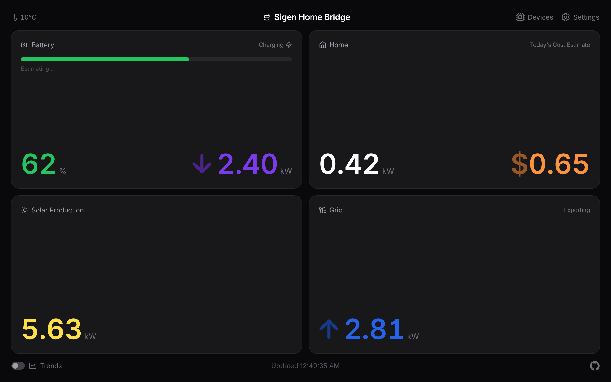
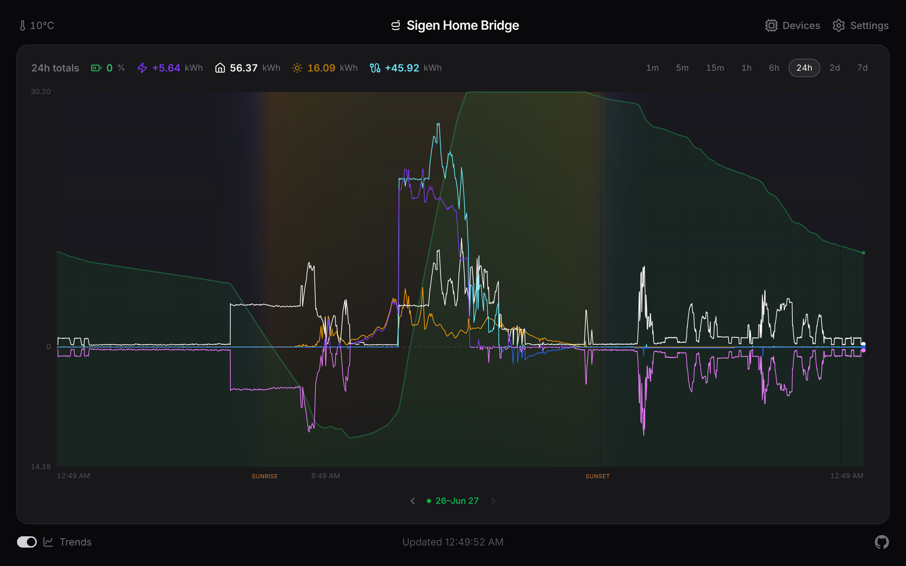
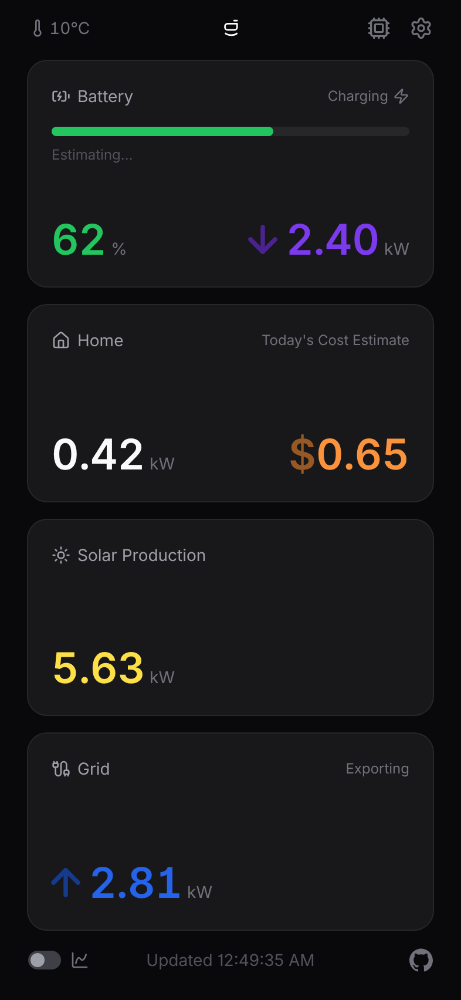
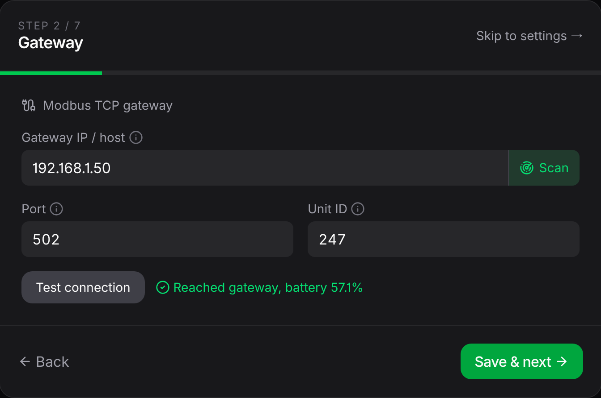
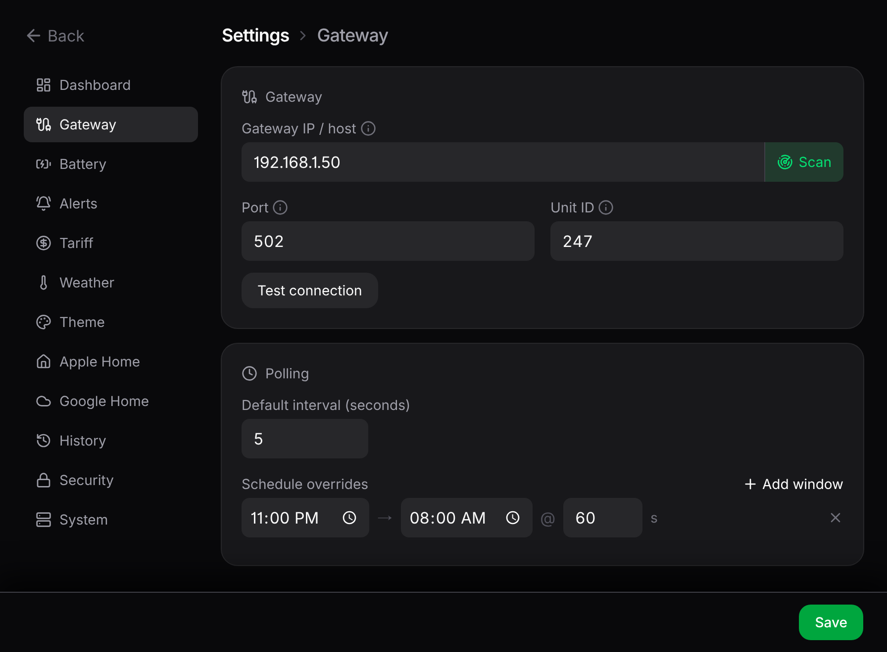
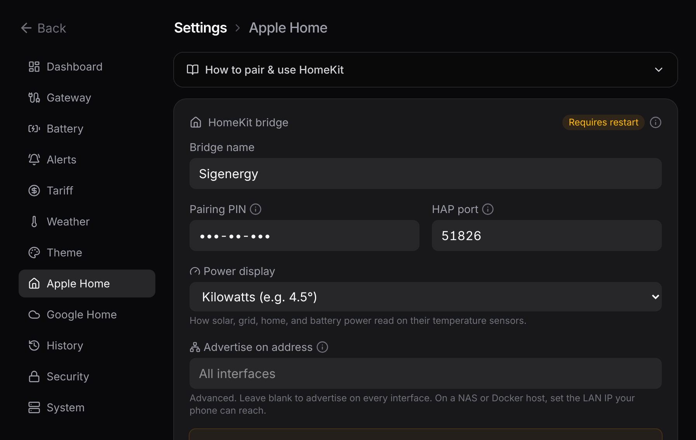
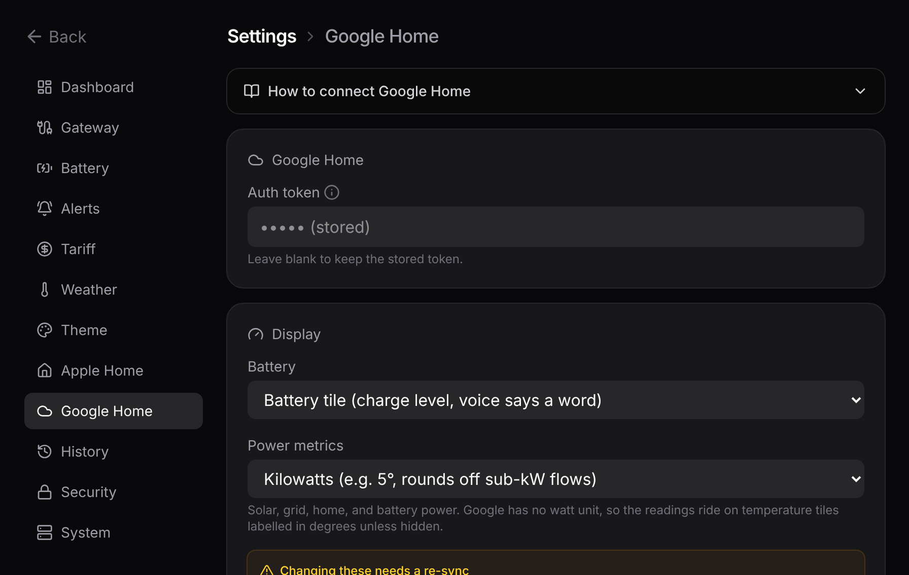
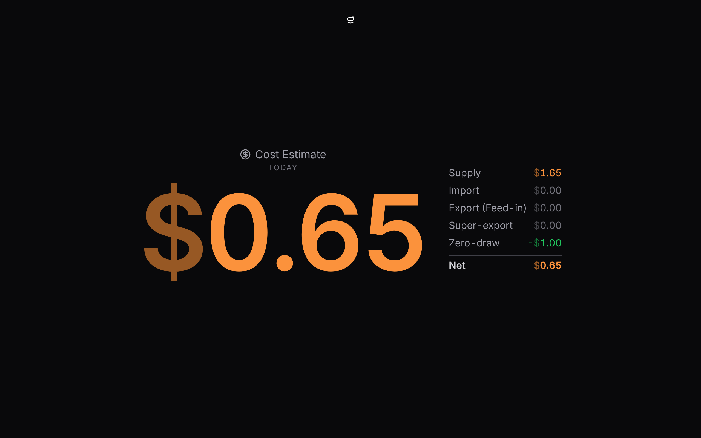
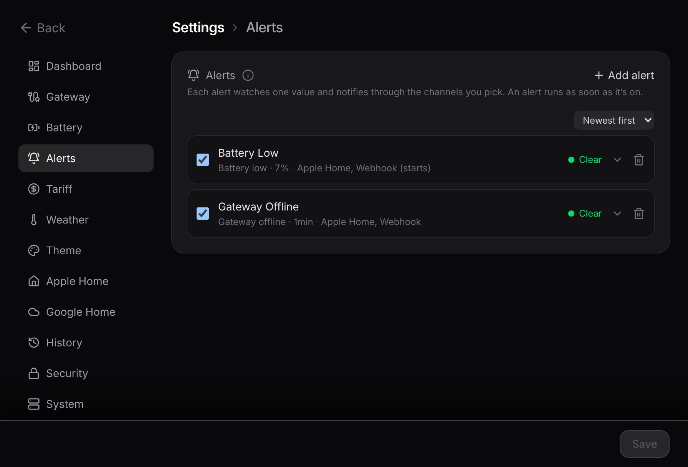
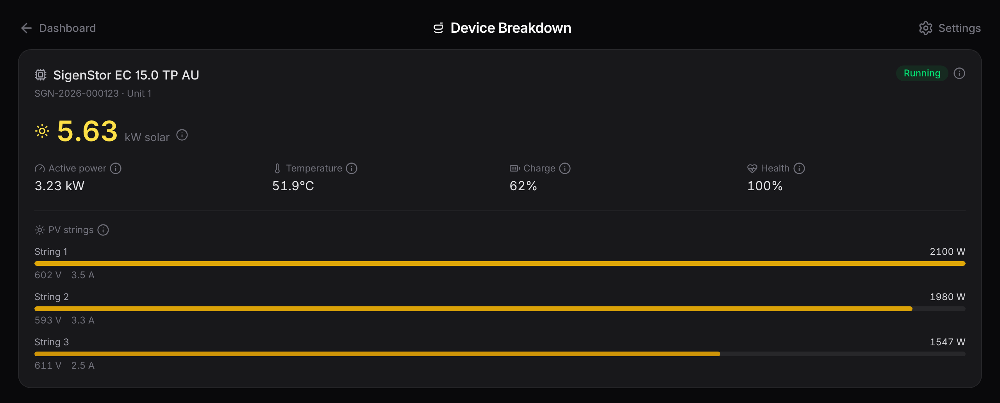

<h1 align="center">sigen-home-bridge</h1>

<p align="center">
  <strong>Your live Sigenergy data via local dashboard, Apple Home, and Google Home.</strong><br/>
  A self-hosted bridge that reads your system directly over your home network.<br/>
  No cloud account or Home Assistant required.
</p>

<p align="center">
  
  
  
  
  
</p>

## Contents

- [Demo](#demo)
- [What `sigen-home-bridge` is](#what-sigen-home-bridge-is)
- [What `sigen-home-bridge` isn't](#what-sigen-home-bridge-isnt)
- [Features](#features)
- [Prerequisites](#prerequisites)
- [Quick start](#quick-start)
- [Configuration](#configuration)
- [Apple Home](#apple-home)
- [Google Home](#google-home)
- [Tariffs & cost](#tariffs--cost)
- [Alerts](#alerts)
- [Devices](#devices)
- [JSON API](#json-api)
- [Security](#security)
- [Technical deep dive](#technical-deep-dive)
- [Troubleshooting](#troubleshooting)
- [Disclaimer](#disclaimer)
- [Contributing](#contributing)
- [Support](#support)
- [Licence](#licence)

## Demo

<https://gist.github.com/user-attachments/assets/880c5c58-977b-4c31-aa68-4e4b008caf52>

## What `sigen-home-bridge` is

`sigen-home-bridge` reads your Sigenergy gateway over Modbus TCP and surfaces its data multiple ways:

- **Web dashboard**: a multi-panel live view plus a scrubbable history chart, responsively resizable for a wall-mounted tablet or spare phone, installable as a home-screen app.
- **Apple Home**: live readings on your iPhone, iPad, and HomePod, usable in automations.
- **Google Home**: sensor support via a free Cloudflare Tunnel.
- **Webhooks**: build alerts on any reading and fire them to a JSON endpoint (ntfy, Pushover, Home Assistant, Discord, etc).
- **JSON feed**: every reading on one live `/api/snapshot` endpoint to poll into your own scripts, spreadsheets, Node-RED, or aggregator.

<p align="center">
  
  <br/><em>Dashboard</em>
</p>

<p align="center">
  
  <br/><em>Trends</em>
</p>

<p align="center">
  
  <br/><em>Mobile Dashboard</em>
</p>

## What `sigen-home-bridge` isn't

- ❌ **A controller:** the bridge is read-only. It never writes to your Sigenergy system, so it can't change charge modes, schedules, or settings.
- ❌ **A Home Assistant integration:** it's a standalone service. If you already run Home Assistant, you may prefer its Sigenergy Modbus integrations instead.
- ❌ **A long-term energy historian:** the trends chart reaches back over your retention window (default 7 days, up to 90), not years. For long-term statistics and billing-grade data, pair it with something purpose-built.
- ❌ **Authenticated:** designed for a trusted home LAN. There's no login, so don't expose the dashboard to the internet (see [Security](#security)).

## Features

- **Live readings**: solar, battery power and charge level, grid import/export, and home consumption, polled directly over Modbus TCP.
- **Battery estimates**: after a few minutes of steady charge or discharge, the dashboard shows time to full or empty, with the projected clock time under the charge bar.
- **Apple Home accessories**: Sensors usable in automations and visible at a glance, paired with a QR code and advertised locally via Bonjour.
- **Google Home sensors**: battery and power readings in the Google Home app, reached through a free Cloudflare Tunnel, with per-device names and watt/kW display modes.
- **Wall-display dashboard**: fullscreen per-metric readouts, adaptive layouts from desktop to phone, and per-view URLs (`/trends`, `/metric/solar`, …) so a kiosk can point straight at one screen.
- **Trends chart**: every metric on one time axis with a day/night sky backdrop and sunrise/sunset markers; scrub with mouse or touch, solo a line, and pick a window from the last minute up to your full retention span. Step back and forth through earlier history with the on-chart controls or the arrow keys. History persists across restarts in a local SQLite store, with a retention window you set and CSV/JSON export under **Settings → History**.
- **Per-device breakdown**: Device Breakdown page lists multiple inverters behind plant totals (model, status, solar, active power, temperature, charge, health, and every PV string), reachable via optional dashboard button.
- **Energy tariffs & cost**: enter your import/export rates and time-of-use windows; the Home tile shows a live running cost (or credit), and its fullscreen breaks down today's supply charge, import, export, credits, and net.
- **Alerts**: build any number of alerts, each watching a value you choose (gateway reachability, battery charge or health, grid import/export, solar, home usage, outdoor temperature, cost per hour) and routed to an Apple Home contact sensor, a JSON webhook (e.g. ntfy, Pushover, Home Assistant, Discord, etc), or both. Debounced so a single missed poll stays quiet; off until you turn it on.
- **Themes**: colour presets or full custom palettes, renameable dashboard title, font size slider, all saved server-side so every consuming device matches.
- **Outdoor temperature**: in the dashboard header, free from Open-Meteo, no API key.
- **Schedule-aware polling**: e.g. every 5s by day, every 60s overnight, so the gateway isn't hammered while nothing changes.
- **Connection-loss handling**: if the gateway drops, the bridge keeps serving the last known values, shows itself offline, and reconnects automatically.
- **Single Docker container**: state (pairing, settings, history) persists in one volume; survives restarts and upgrades.
- **Settings passcode**: optionally lock the settings behind a PIN (**Settings → Security**), so a guest on your network can watch the dashboard without corrupting your settings (enforced server-side).
- **First-run wizard**: open the dashboard and it walks you through pointing the bridge at your gateway. Every setting is editable in the UI afterwards (`.env` is optional).

## Prerequisites

- A **Sigenergy system** with Modbus TCP enabled in mySigen (step 1 below; may require installer-level access on some accounts).
- **Docker + Docker Compose** on a machine on the same LAN as the gateway.
- For **Google Home only**: a free Cloudflare account and a Google Home Developer Console project.

## Quick start

### 1. Enable Modbus TCP on your system

In the mySigen iOS app (as of June 2026): **Settings → System Settings → General → Modbus TCP Server Settings**, then toggle it on.

> [!NOTE]<br>
> If the option is missing, your account may need installer-level access; ask your installer to enable it.

### 2. Deploy

```bash
git clone https://github.com/furey/sigen-home-bridge
cd sigen-home-bridge
cp .env.example .env
docker compose up -d --build
```

> [!NOTE]<br>
> The container runs with `network_mode: host` because Apple Home discovery (Bonjour/mDNS) doesn't traverse Docker's bridge network. On a host with extra Docker networks (typical on a NAS), also set `HOMEKIT_BIND=eth0` (your LAN interface) in `.env` (see [Troubleshooting](#troubleshooting)).

### 3. Open the dashboard

Browse to `http://<host-ip>:5163`. On first run a short setup wizard walks you through pointing the bridge at your gateway: the **Scan** button sweeps your LAN for the open Modbus port and verifies each hit with a real register read, then **Test connection** confirms it before you continue. From there you set a poll cadence and optionally configure weather, Apple Home, and Google Home. Only the gateway step is required.

<p align="center">
  
  <br/><em>Wizard → Gateway</em>
</p>

If **Scan** can't find the gateway, set its address yourself. Don't use the IP shown in the mySigen app; that's the gateway's *internally-reported* address and is usually on a different subnet from your LAN. Find the real one with nmap (substitute your subnet):

```bash
nmap -Pn -p 502 192.168.1.0/24
```

The host showing `502/tcp open` (not `filtered`) is your gateway. Enter it in the wizard, or set `SIGEN_IP` in `.env` before deploying. Either way, give the gateway a static DHCP lease on your router so the address never changes.

### 4. Pair Apple Home (optional)

The bridge prints a pairing QR code and PIN to its log on startup:

```bash
docker logs sigen-home-bridge
```

> [!TIP]<br>
> The same QR and pairing code also live in the dashboard under **Settings → Apple Home → How to pair & use HomeKit**, so you can pair without opening the logs.

In the Home app: **Add Accessory**, then scan the QR (or choose **More Options** to type the PIN, default `516-35-163`). The bridge isn't Apple-certified, so the Home app flags it as an uncertified accessory; tap **Add Anyway** to continue. Pairing survives restarts and upgrades.

### 5. Save it as an app (optional)

The dashboard installs as a home-screen app on any iPhone or iPad: open it in Safari, then **Share → Add to Home Screen**. It gets its own icon and launches fullscreen (no address bar or Safari chrome); this is also the easiest way to set up a spare phone or tablet as a permanent wall display. Android works the same way via Chrome's **Add to Home screen**.

Settings (the gear icon) lets you change everything later (polling schedules, battery capacity, reserve and charge display (% or kWh), power units, alerts, tariffs, themes, weather, HomeKit, Google Home, etc) with no `.env` editing and, for most changes, no restart.

<p align="center">
  
  <br/><em>Settings → Gateway</em>
</p>

## Configuration

Most setups need no `.env` at all: everything is configurable in the dashboard's settings UI, saved server-side, and applied live in most cases. The `.env` file only seeds the first boot; the handful of values you might actually set there:

| Variable       | Default            | Why you'd set it                                               |
| -------------- | ------------------ | -------------------------------------------------------------- |
| `SIGEN_IP`     | *(empty)*          | Your gateway's LAN address (or just use the wizard)            |
| `TZ`           | `UTC`              | Your local timezone, so polling schedules use local time       |
| `HOMEKIT_BIND` | *(all interfaces)* | Your LAN interface (e.g. `eth0`) on hosts with Docker networks |
| `HOMEKIT_PIN`  | `516-35-163`       | A pairing PIN of your own                                      |
| `SERVER_PORT`  | `5163`             | If 5163 clashes with something else                            |

The full variable reference, the settings-precedence rules, and the schedule syntax are in [`docs/DEEP_DIVE.md`](docs/DEEP_DIVE.md#full-configuration-reference).

Bridge state (HomeKit pairing, saved settings, chart history, etc) lives in a named Docker volume (`sigen-data`) that survives restarts, rebuilds, and `docker compose down`. Only `down -v` wipes it. To keep state in a host folder you can browse instead, swap `sigen-data:/data` for a bind mount like `./data:/data` in `compose.yaml`.

## Apple Home

The Apple Home app has no native "power" sensor it will actually display, so the bridge maps each power reading onto a Temperature sensor (the only built-in type that shows a signed decimal) and battery charge onto a Humidity sensor. The `°` and `%` symbols are cosmetic; read temperatures as power and humidity as battery charge:

| In the Home app  | Actually means                 | Example                      |
| ---------------- | ------------------------------ | ---------------------------- |
| Solar Production | Solar output in kW             | `3.2°` = generating 3.2 kW   |
| Home Consumption | Home usage in kW               | `1.0°` = using 1.0 kW        |
| Grid Power       | kW, + importing / − exporting  | `-1.1°` = exporting 1.1 kW   |
| Battery Power    | kW, + charging / − discharging | `-2.6°` = discharging 2.6 kW |
| Battery Percent  | Battery state of charge        | `31%` = 31% charged          |

The readings land under Climate, with the four power sensors grouped into one Temperature tile (tap it to see each named reading) and the battery as a Humidity tile. A Battery service underneath flags low battery below 20%. Use HomeKit for glances and automations; use the dashboard for the properly labelled view. The full rationale is in [`docs/DEEP_DIVE.md`](docs/DEEP_DIVE.md#apple-home-mapping-rationale).

The power sensors default to kW; **Settings → Apple Home** can switch them to watts (`4500°` instead of `4.5°`), and rename any device. Both are read when the bridge boots, so save and restart; because Apple Home keeps the names it paired with, remove and re-add the accessory to see new names.

One catch: a Temperature sensor is displayed in your home's temperature unit. If your Apple Home is set to Fahrenheit, it converts these values (`4.5` shows as `40.1°F`), so the number no longer matches the kW or watts. Set the Home app to Celsius to read them directly, or just use the dashboard.

You set all of it from **Settings → Apple Home**: the pairing QR and code, the bridge name, PIN, and port, the kW/watts switch, and an editable name for every sensor.

<p align="center">
  
  <br/><em>Settings → Apple Home</em>
</p>

## Google Home

Google Home support is best-effort: Google's smart-home integrations are cloud-to-cloud, so its servers call a public HTTPS endpoint rather than reaching the bridge on your LAN. That means more setup than Apple Home (a tunnel to expose the fulfillment endpoint) and Google renders the readings less cleanly. To get it working:

1. Create a free Cloudflare Tunnel routing a hostname to `http://localhost:5163`, put the token in `CLOUDFLARE_TUNNEL_TOKEN`, and start the bundled sidecar: `docker compose --profile tunnel up -d`.
2. In the [Google Home Developer Console](https://console.home.google.com), create a cloud-to-cloud project. Set the fulfillment URL to `https://<your-tunnel-host>/fulfillment` and the OAuth Authorization and Token URLs to `/auth` and `/token` on the same host. Client ID and secret can be any non-empty values; the bundled stub OAuth ignores them.
3. Set the Auth token in **Settings → Google Home** to any value (the shared bearer the stub returns), then link the project in the Google Home app.

The battery shows up as a proper battery tile (charge level and charging state) via Google's EnergyStorage trait. The four power metrics (solar, grid, home, battery power) have no native Google watt unit, so they ride in on read-only temperature tiles: the number is your live watts, but Google labels it with a degree symbol and rounds to a whole number, the same trade-off the [HomeKit](#apple-home) sensors make. **Settings → Google Home** can rename each device and set how it renders: the battery as a tile or a voice-readable percentage, and the power metrics in watts, kilowatts, or hidden. Details, caveats, and a sequence diagram are in [`docs/DEEP_DIVE.md`](docs/DEEP_DIVE.md#google-home-fulfillment).

You set all of it from **Settings → Google Home**: the auth token (write-only, shown as stored once set), the battery and power display modes, and a name for each device. These are read per request, so a rename or new token applies on the next sync; switching a display mode swaps the device's trait, so Google needs a relink to pick that up.

<p align="center">
  
  <br/><em>Settings → Google Home</em>
</p>

## Tariffs & cost

Enter your electricity rates in **Settings → Tariff** and the bridge turns the live grid flow into money. Set a fallback import and export (feed-in) rate, then add time-of-use windows to override them: a peak window, an off-peak window, a free period (just a window at rate 0). Windows wrap past midnight and are read in the device's local time.

One switch turns the figures on. The Home tile splits in two (consumption on the left, cost on the right) and each half opens its own fullscreen. The cost figure shows either today's running net (feed-in and credits minus import and the daily supply charge; the default) or the current per-hour rate. Tapping it opens the full breakdown: import, feed-in, credits, supply, and net. A cost reads plain in orange; a credit shows a leading − in green (a minus means money in your favour), both themeable in **Settings → Theme**.

It also models two less-common credits some plans offer: a flat daily amount for drawing no grid power across a window (an evening-peak "zero-draw" reward), and a bonus rate for the first capped kWh exported in a window each day.

<p align="center">
  
  <br/><em>Cost Estimate Metric View</em>
</p>

> [!IMPORTANT]<br>
> Displayed figures are an **estimate only** based on your rates and power readings and as such, should be treated as a guide and not depended on for billing or financial decisions.

## Alerts

**Settings → Alerts** watches the live feed and tells you when something needs attention. Build any number of alerts; each runs the moment you switch it on, so there's no master toggle. A short form builds one (pick a trigger, name it, choose where it goes), and the list is a collapsible row per alert, sorted newest first, oldest, or by name. Triggers cover the gateway (offline or back online), battery charge and health, grid import and export, solar output, home usage, outdoor temperature, and cost per hour, with the form offering only what your setup can measure. An alert must stay tripped for a short delay before it fires, so a single dropped poll or a momentary spike never raises a false alarm; threshold alerts clear once the value moves back past the line with a margin. The collapsed row shows each alert's condition, destinations, and live state at a glance.

<p align="center">
  
  <br/><em>Settings → Alerts</em>
</p>

Each alert routes to **Apple Home**, a **webhook**, or both, set on the alert itself. Apple Home exposes it as a contact sensor that reads Open while active (with an optional custom name); turn on the sensor's own notifications in the Home app to be alerted, since the alert lives in the sensor's settings rather than an Automation, and remote notifications need a home hub (a HomePod or Apple TV). These sensors are read at boot, so adding, renaming, or retargeting one needs a restart. A webhook gets its own URL per alert, so different alerts can hit different endpoints (ntfy, Discord, Home Assistant, etc), and fires a JSON POST when the alert starts, ends, or both; for example, a gateway-offline alert posting on its "end" edge is your "back online" ping. Webhook payload fields and edge semantics are in [`docs/DEEP_DIVE.md`](docs/DEEP_DIVE.md#alerts).

## Devices

The four dashboard panels show plant-level totals: every inverter and PV string summed into one number. The **Device Breakdown** page (`/devices`) opens them up individually. Each inverter the bridge finds on the gateway gets a device info card with its model, serial, unit ID, running state, live solar and active power, temperature, and own charge and health, plus a bar per PV string carrying that string's watts, volts, and amps.

<p align="center">
  
  <br/><em>Device Breakdown</em>
</p>

Open it from the **Devices** button in the dashboard header or from **Settings → System**. The page is read-only and updates over the dashboard's live stream; the same per-device data also feeds the [`/api/snapshot`](#json-api) `devices` array. How discovery works, and which device types aren't read yet, is in [`docs/DEEP_DIVE.md`](docs/DEEP_DIVE.md#multiple-inverters-and-sources).

## JSON API

Everything the dashboard shows is also a plain JSON request away, so you can build your own readout, log the numbers to a spreadsheet, feed them into Home Assistant, Node-RED, a shell script, etc:

```sh
curl http://<host-ip>:5163/api/snapshot
```

The `/api/snapshot` endpoint returns live power flows (solar, battery, grid, and home, in watts and signed for direction), battery charge and health, today's and lifetime energy totals, the outdoor weather, any active alerts, a per-device breakdown of each inverter the gateway exposes (model, status, power, temperature, and each PV string), and, once you've entered tariffs, today's cost breakdown and the current rate. The battery time-to-full/empty estimate and the cost figures are computed server-side and included, so a consumer doesn't have to reproduce the dashboard's maths. Every response carries a `schema` version, the units in use, and timestamps:

```jsonc
/*
  Example `/api/snapshot` response.
*/
{
  "schema": 1,
  "generatedAt": "2026-06-26T03:15:01.289Z",
  "lastUpdated": "2026-06-26T03:14:56.566Z",
  "connected": true,
  "pollIntervalMs": 5000,
  "units": {
    "power": "W",
    "energy": "kWh",
    "temperature": "celsius",
    "currency": "AUD"
  },
  "power": {
    "solar": 2225,
    "solarSigen": 2225,
    "solarThirdParty": 0,
    "home": 6946,
    "homeGeneral": 6945,
    "grid": 4695,
    "battery": -26,
    "gridDirection": "import",
    "batteryDirection": "discharge"
  },
  "battery": {
    "soc": 100,
    "soh": 100,
    "capacityKwh": 40.3,
    "reserveSoc": 0,
    "energyRemainingKwh": 40.3,
    "direction": "discharge",
    "estimate": {
      "status": "idle"
    }
  },
  "energy": {
    "consumedToday": 40.8,
    "lifetime": {
      "pv": 1455.26,
      "consumed": 2388.99,
      "gridImport": 1102.89,
      "gridExport": 146.48,
      "batteryCharge": 1472.83,
      "batteryDischarge": 1400.17
    }
  },
  "weather": {
    "outdoorTemp": 15.9,
    "weatherCode": 1,
    "location": "Sydney",
    "latitude": -33.8829,
    "longitude": 151.0973
  },
  "tariff": {
    "currency": "AUD",
    "netPerHour": 0,
    "today": {
      "importCost": 0.0002,
      "feedIn": 0,
      "superExportCredit": 0,
      "zeroDrawCredit": 1,
      "zeroDrawMet": true,
      "supply": 1.65,
      "net": -0.6502
    }
  },
  "alerts": [],
  "devices": [
    {
      "type": "inverter",
      "unitId": 1,
      "model": "SigenStor EC 15.0 TP AU",
      "serial": "SGN-2026-000123",
      "status": "running",
      "activePower": 2219,
      "solarPower": 2518,
      "temperature": 54.2,
      "soc": 100,
      "soh": 100,
      "strings": [
        {
          "index": 1,
          "voltage": 296.5,
          "current": 1.96,
          "power": 581
        },
        {
          "index": 2,
          "voltage": 472,
          "current": 1.59,
          "power": 750
        },
        {
          "index": 3,
          "voltage": 539.6,
          "current": 2.2,
          "power": 1187
        }
      ]
    }
  ],
  "history": {
    "count": 111777,
    "firstT": 1781838901437,
    "lastT": 1782443696566,
    "links": {
      "recent": "/api/history",
      "export": "/api/history/export?format=json&every=300"
    }
  }
}
```

For history, `GET /api/history` returns the recent samples behind the trends chart and `GET /api/history/export?format=json&every=300` returns the full retained series (CSV too, with `format=csv`). The snapshot is read-only and unauthenticated like the rest of the dashboard, so keep it on your LAN. [`docs/DEEP_DIVE.md`](docs/DEEP_DIVE.md#http-api) documents every endpoint, field, unit, and sign convention.

## Security

The dashboard and its read APIs have no authentication; anyone who can reach the port can view your readings. What you can lock is changing things: set a passcode under **Settings → Security** and the settings API rejects every change that doesn't carry a valid session token, so a guest on your LAN can watch the dashboard but can't edit your settings. Treat it as a deterrent for a shared home network, not real security: there are no user accounts, traffic is plain HTTP, and the readings stay open. Forgot it? Delete `data/settings.json` (or just its `security` block) on the host and restart.

- Don't port-forward or reverse-proxy the dashboard to the internet, passcode or not.
- The optional Google path exposes only the narrow fulfillment endpoints through the Cloudflare Tunnel, guarded by a shared token; treat that token as a secret.
- The bridge is read-only against your Sigenergy system, so worst case is exposure of your energy readings, not control of your hardware.

For more detail, see: [`docs/DEEP_DIVE.md`](docs/DEEP_DIVE.md#security-model)

## Technical deep dive

Architecture diagrams, the Modbus register map, the poller state machine, settings precedence, project layout, local development setup and more are all documented in [`docs/DEEP_DIVE.md`](./docs/DEEP_DIVE.md).

## Troubleshooting

**The bridge can't connect to the gateway**

- Make sure you used the IP from a scan, not the one shown in the mySigen app (see [Quick start step 3](#3-open-the-dashboard)).
- Confirm Modbus TCP is still toggled on in mySigen, and the unit ID is `247` (the default).
- Use the **Scan** and **Test connection** buttons in **Settings → Gateway** to check from the bridge's point of view.
- Verify the gateway didn't change address; set a static DHCP lease if you haven't.

**Apple Home can't find the accessory, or is slow to respond**

- The container must run with host networking (the bundled `compose.yaml` already does).
- On a NAS or any host with extra Docker networks, set `HOMEKIT_BIND` to your LAN interface (e.g. `eth0`) or its IP, so the bridge doesn't advertise on unreachable internal `172.x` addresses.
- Your phone must be on the same LAN/VLAN as the host; mDNS doesn't cross subnets without help.

**The Home app shows degrees instead of kilowatts**

- That's by design; see [Reading the numbers in Apple Home](#reading-the-numbers-in-apple-home).

**The dashboard tiles froze**

- The footer shows connection state and last update; if the gateway dropped, the bridge keeps the last known values and reconnects automatically.
- If an iOS home-screen web app has gone stale, tap the dashboard title to reload the app.

**No outdoor temperature in the header**

- Weather needs outbound internet (Open-Meteo). The first run locates you by the server's public IP; set `LATITUDE`/`LONGITUDE` in settings if it guessed wrong, or disable weather entirely.

**The cost figures look wrong**

- They're an estimate from the rates you enter, not a bill; see [Tariffs & cost](#tariffs--cost) for what it can't model. Check **Settings → Tariff** has the right rates, windows (in local time), and currency, and that enough history has built up for today.

**Settings change didn't apply**

- Almost everything applies live, but HomeKit fields and the server port are marked "requires restart"; `docker compose restart` picks them up.

**I changed `.env` but nothing happened**

- `.env` only seeds the *first* boot. Once you've saved settings in the UI, the UI's values win. Change it in Settings instead (or use Reset to fall back to the env seeds).

**Cloudflare Tunnel logs fill with "control stream encountered a failure"**

- `cloudflared` defaults to the QUIC transport over UDP, and some hosts (a Synology NAS being the usual culprit) cap the UDP receive buffer below what QUIC wants. One of the four edge connections then wedges in a constant reconnect loop while the other three carry traffic, so the tunnel still serves but the logs fill with `failed to serve tunnel connection` and `failed to run the datagram handler` errors.
- Force TCP instead: add `TUNNEL_TRANSPORT_PROTOCOL=http2` to the `cloudflared` service's `environment`, then recreate the container. All four connections come up on TCP/7844 and the QUIC/UDP path is skipped.
- A startup line about the UDP receive buffer being smaller than wanted is harmless on http2; QUIC probes a socket at boot but no QUIC data path is used.

## Disclaimer

This project:

- Is licensed under the [MIT License](./LICENSE).
- Is not affiliated with or endorsed by Sigenergy, Apple, Google, or Cloudflare.
- Reads from your system over Modbus TCP but never writes to it.
- Is written with the assistance of AI and may contain errors.
- Is provided as-is with no warranty; use at your own risk.

> [!IMPORTANT]<br>
> `sigen-home-bridge` was built and tested against the author's personal Sigenergy system: a single SigenStor inverter with rooftop solar and a battery, no EV charger or generator. Beyond the plant-level totals every system reports, the bridge will try to read setups it hasn't yet been tested against e.g. more than one inverter, AC-coupled third-party PV, etc. Those follow Sigenergy's published Modbus map but are unverified on other hardware, and some device types (EV chargers, generators, vehicle-to-home) aren't read yet. If a reading looks wrong on your system, flag it in [Discussions](https://github.com/furey/sigen-home-bridge/discussions).

## Contributing

If you hit a problem or want to compare notes, start a thread in [Discussions](https://github.com/furey/sigen-home-bridge/discussions).

## Support

If you've found this project helpful consider supporting my work through:

[Buy Me a Coffee](https://www.buymeacoffee.com/furey) | [GitHub Sponsorship](https://github.com/sponsors/furey)

Your support helps me keep developing the project and adding new features.

## Licence

MIT. See [LICENSE](LICENSE).
