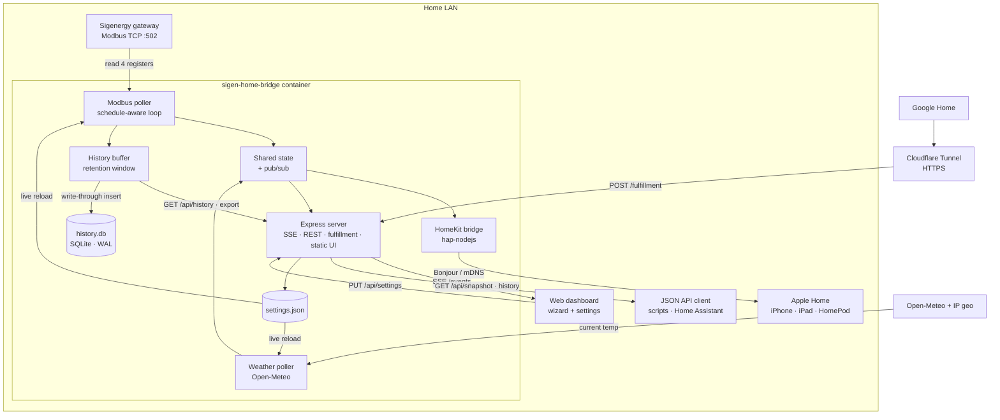
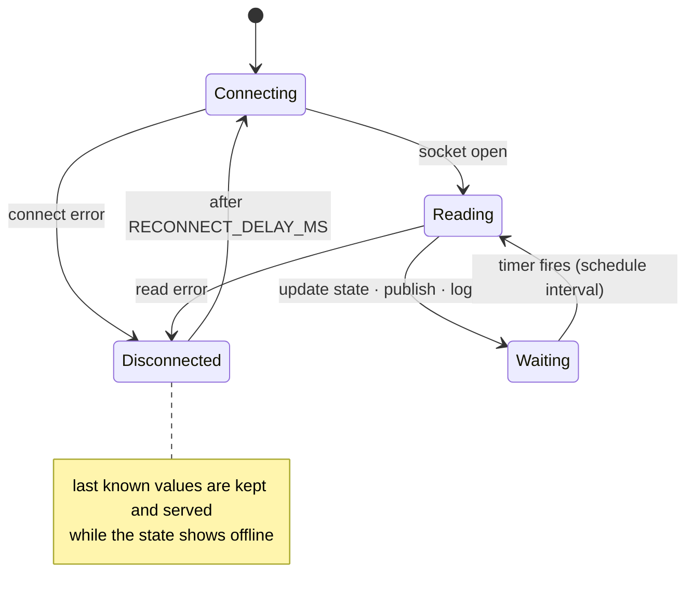
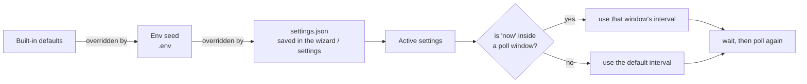
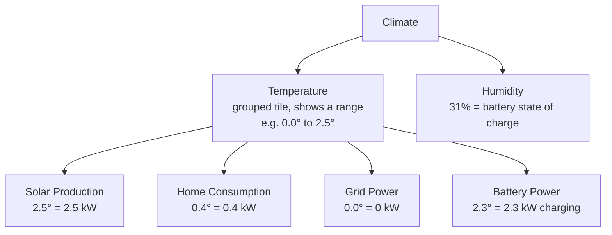
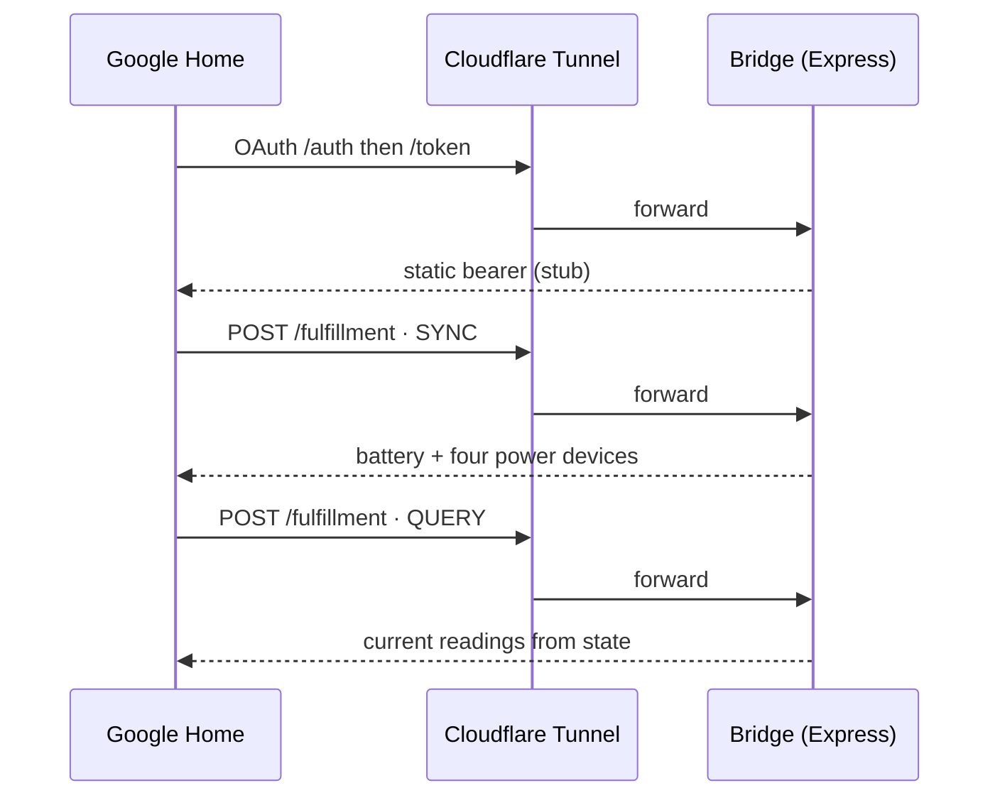

# Technical Deep Dive

The technical companion to [`README.md`](../README.md): what the bridge is doing under the hood, and why it works the way it does.

## Contents

- [Architecture](#architecture)
- [Poller lifecycle](#poller-lifecycle)
- [Settings precedence](#settings-precedence)
- [Full configuration reference](#full-configuration-reference)
- [Register map](#register-map)
- [Multiple inverters and sources](#multiple-inverters-and-sources)
- [Control registers](#control-registers)
- [Apple Home mapping rationale](#apple-home-mapping-rationale)
- [Dashboard internals](#dashboard-internals)
- [HTTP API](#http-api)
- [Energy tariffs](#energy-tariffs)
- [Alerts](#alerts)
- [Google Home fulfillment](#google-home-fulfillment)
- [Cloudflare Tunnel](#cloudflare-tunnel)
- [Local development](#local-development)
- [Regenerating the README screenshots](#regenerating-the-readme-screenshots)
- [Recording the walkthrough video](#recording-the-walkthrough-video)
- [Project layout](#project-layout)
- [Scripts](#scripts)
- [Verifying the gateway](#verifying-the-gateway)
- [Security model](#security-model)

## Architecture



A single process holds one persistent Modbus TCP socket to the gateway and polls four registers on a timer (battery power is derived from them). Each cycle writes to a shared in-memory state object and pushes it to three consumers:

- **HomeKit** via `hap-nodejs`, advertised over your LAN with Bonjour. Fully local, no cloud.
- **Google Home** via Smart Home fulfillment over HTTPS (needs a tunnel; see [Google Home fulfillment](#google-home-fulfillment)).
- **The dashboard** via Server-Sent Events, so the browser updates the instant a poll completes.

Each cycle is also appended to an in-memory history buffer that backs the dashboard's trends chart, served over `GET /api/history` (the recent 20,000 samples, or a downsampled slice when the chart reaches further back). The buffer is the read cache; the durable copy is a SQLite database at `/data/history.db` (built-in `node:sqlite`, WAL mode), written through one row per poll rather than rewriting a snapshot, so a week of 5-second readings costs a few MB of writes a day instead of gigabytes (safe on an SD card or SSD). A configurable retention window (Settings → History, default 7 days) bounds both the buffer and the database; older samples are trimmed in memory on each poll and pruned from the database on a five-minute timer. The full retained set exports as CSV or JSON, optionally thinned to one row per interval, via `GET /api/history/export`; `GET /api/history/stats` reports the held count and span. An existing `history.json` from an older build is imported into the database once on first boot and renamed to `history.json.imported`.

A separate timer fetches the outdoor temperature from Open-Meteo and merges it into the same state. All configuration (gateway, polling, weather, HomeKit, Google) is editable in the dashboard's setup wizard and settings page, saved to `settings.json`, with most changes applied live (gateway edits reconnect the socket; HomeKit and the server port need a restart).

The gateway address can also be auto-detected. `POST /api/discover/gateway` (the **Scan** button on the gateway field in the wizard and settings) derives the /24 around each non-internal IPv4 interface (host networking means these are the real LAN interfaces), attempts a plain TCP connect to the Modbus port on all 254 hosts (64 concurrent, 600 ms timeout), then confirms each answering host with an actual SoC register read so only a real Sigenergy gateway qualifies. A clean sweep of an empty subnet takes about 3 seconds; the wizard runs it automatically when the gateway field is blank, fills the field on a single match, and offers a pick list if several answer.

## Poller lifecycle

If the gateway drops, the poller logs the error, marks the state disconnected, and retries on a fixed delay without ever crashing or zeroing the last known values.



The weather poller is similarly failure-tolerant: a failed fetch gets one immediate second attempt, and until the first reading lands the poller tries every 30 seconds (the same cadence covers a failed location lookup) before settling into the normal refresh interval, so a flaky API briefly delays the temperature instead of hiding it until the next restart.

## Settings precedence

Every value in `.env` is a seed for first boot. Once you save in the UI it's written to `/data/settings.json`, which takes precedence (`TZ`, `CLOUDFLARE_TUNNEL_TOKEN`, and `DATA_DIR` are the exceptions; they're read from the environment at process start). Most changes apply immediately: editing the gateway reconnects the Modbus socket, weather reloads its fetch loop, and poll edits take effect on the next cycle. The HomeKit fields and the HTTP server port can't change on a running process, so they're marked "requires restart" and apply on the next start. The Google token is write-only: it's never sent back to the browser (shown as `••••• (stored)`), so leave it blank to keep the current value. The optional Settings passcode is similar: it lands in the `security` section as a salted scrypt hash, the API reports only whether one is set, and once set every settings change must carry a session token from `POST /api/unlock`. Reset wipes `settings.json` back to the env seeds and re-runs the wizard.



For polling, set a default interval, then add overrides: time windows that poll at their own rate. For example, keep the default at 5 seconds and add an overnight override of 60 seconds from 23:00 to 08:00, so the system isn't hammered while nothing changes. Windows use the container's local time, so set `TZ`.

## Full configuration reference

Copy `.env.example` to `.env`. Every value has a default. These are seeds for the first boot; once you save in the wizard or settings they're written to `/data/settings.json`, which takes precedence.

| Variable                  | Default                    | Purpose                                                                 |
| ------------------------- | -------------------------- | ----------------------------------------------------------------------- |
| `SIGEN_IP`                | _(empty)_                  | Gateway address; set it or use the setup wizard                         |
| `SIGEN_PORT`              | `502`                      | Modbus TCP port                                                         |
| `SIGEN_UNIT_ID`           | `247`                      | Plant (aggregate) unit ID                                               |
| `POLL_INTERVAL_MS`        | `5000`                     | Fallback interval when no schedule window matches                       |
| `RECONNECT_DELAY_MS`      | `10000`                    | Delay between reconnect attempts                                        |
| `POLL_SCHEDULE`           | _(empty)_                  | Seed for the schedule editor, e.g. `08:00-12:00@5000,17:00-21:00@10000` |
| `TZ`                      | `UTC`                      | Local time zone for schedule windows                                    |
| `SERVER_PORT`             | `5163`                     | Dashboard and fulfillment port                                          |
| `WEATHER_ENABLED`         | `true`                     | Set `false` to hide the header temperature and skip all weather calls   |
| `LATITUDE`                | _(auto via IP)_            | Pin exact latitude; unset means a one-off IP-based geolocation          |
| `LONGITUDE`               | _(auto via IP)_            | Pin exact longitude; unset means a one-off IP-based geolocation         |
| `WEATHER_UNITS`           | `celsius`                  | `celsius` or `fahrenheit`                                               |
| `WEATHER_REFRESH_MS`      | `600000`                   | How often to refresh the outdoor temperature                            |
| `HISTORY_RETENTION_DAYS`  | `7`                        | Days of trend history to keep (1–90); editable under Settings → History |
| `HOMEKIT_NAME`            | `Sigenergy`                | HomeKit bridge name                                                     |
| `HOMEKIT_PIN`             | `516-35-163`               | HomeKit pairing PIN                                                     |
| `HOMEKIT_PORT`            | `51826`                    | HAP server port                                                         |
| `HOMEKIT_BIND`            | _(all interfaces)_         | Limit the HomeKit advertisement to one interface/IP (e.g. `eth0`)       |
| `GOOGLE_AUTH_TOKEN`       | `sigen-home-bridge-token`  | Static bearer for the stub OAuth                                        |
| `CLOUDFLARE_TUNNEL_TOKEN` | _(empty)_                  | Token for the `cloudflared` sidecar                                     |
| `DATA_DIR`                | `./data` (Docker: `/data`) | Pairing state and saved settings                                        |

`POLL_SCHEDULE` is a comma-separated list of `HH:MM-HH:MM@INTERVAL_MS` windows. A window may wrap past midnight (`22:00-06:00`). The first matching window wins; outside all of them the default interval applies. Once you save in the dashboard, `/data/settings.json` overrides this seed.

## Register map

All values are input registers (function code `0x04`), read at their raw addresses (no `30001` offset). Power registers are signed 32-bit big-endian in watts; SOC and SOH are 16-bit values scaled by ten; energy counters are unsigned big-endian integers scaled by 100 to kWh.

| Signal                     | Register | Words | Type        | Meaning                                       |
| -------------------------- | -------- | ----- | ----------- | --------------------------------------------- |
| `gridPower`                | 30005    | 2     | int32 W     | Grid power (positive import, negative export) |
| `batterySoc`               | 30014    | 1     | uint16 ÷10  | Battery state of charge, percent              |
| `sigenPvPower`             | 30035    | 2     | int32 W     | Sigenergy DC solar production                 |
| `ratedEnergyCapacity`      | 30083    | 2     | uint32 ÷100 | Installed battery capacity, kWh               |
| `batterySoh`               | 30087    | 1     | uint16 ÷10  | Battery state of health, percent              |
| `lifetimePv`               | 30088    | 4     | uint64 ÷100 | Cumulative PV generation, kWh                 |
| `consumedToday`            | 30092    | 2     | uint32 ÷100 | Home consumption since midnight, kWh          |
| `lifetimeConsumed`         | 30094    | 4     | uint64 ÷100 | Cumulative home consumption, kWh              |
| `thirdPartyPvPower`        | 30194    | 2     | int32 W     | Third-party (AC-coupled) solar, 0 without one |
| `lifetimeBatteryCharge`    | 30200    | 4     | uint64 ÷100 | Cumulative battery charge, kWh                |
| `lifetimeBatteryDischarge` | 30204    | 4     | uint64 ÷100 | Cumulative battery discharge, kWh             |
| `lifetimeGridImport`       | 30216    | 4     | uint64 ÷100 | Cumulative grid import, kWh                   |
| `lifetimeGridExport`       | 30220    | 4     | uint64 ÷100 | Cumulative grid export, kWh                   |
| `generalLoadPower`         | 30282    | 2     | int32 W     | House load excluding EV chargers/smart loads  |
| `loadPower`                | 30284    | 2     | int32 W     | Home consumption (total, includes EV)         |

Solar is the sum of two registers, not one. `pvPower` (what the dashboard and HomeKit show) is `sigenPvPower` (30035, the Sigenergy DC arrays) plus `thirdPartyPvPower` (30194, an AC-coupled third-party inverter the gateway meters via a CT sensor). On a system with no third-party PV the second register reads 0, so `pvPower` equals `sigenPvPower`. `generalLoadPower` (30282) is the house load with the EV chargers and trackable smart loads removed, alongside the total at 30284.

Battery power is derived, not read. Register 30037 ("ESS power") is the gross battery output, which includes the system's own draw (BMS, cooling, controller, gateway) and so reads higher than the mySigen app's battery figure (by ~0.2–0.3 kW at idle). Instead `batteryPower` is computed as `pvPower + gridPower − loadPower` (positive charging, negative discharging), which matches the app and keeps solar, battery, grid, and home in balance; folding third-party PV into `pvPower` keeps that balance right on AC-coupled systems too. `npm run probe` still prints raw register 30037 as `essPower` alongside the derived value for comparison.

If a register returns a Modbus exception (illegal data address, common on older firmware), the poller logs it once and skips that register for the rest of the session; the corresponding state field stays `null`. The four core power and SoC registers are present on every known firmware version. The others were verified against a specific installation; `npm run probe` is the quickest way to confirm what yours supports before relying on them.

`ratedEnergyCapacity` feeds the battery time-to-empty estimate as an automatic fallback when the capacity field in Settings → Battery is blank, so the kWh line in the estimate appears without any manual configuration on firmware that reports this register.

## Multiple inverters and sources

The registers above are the plant totals, read on the plant unit (247). A Sigenergy system can have more behind those totals: more than one inverter, several PV strings per inverter, AC-coupled third-party PV, EV chargers, and a generator. The protocol separates these by Modbus **unit ID**, not by register offset; each device answers on its own slave ID over the same TCP connection. The plant unit aggregates them (its `pvPower` already sums every inverter, its `loadPower` already includes any EV charger), so the dashboard's four-panel view stays correct no matter how many devices are present. What the plant totals don't give you is the breakdown, and that's what `server/devices.js` adds.

On each connect the bridge sweeps unit IDs 1–4, reading the inverter model string (30500) with a short timeout; any that answer are recorded as inverters (`server/devices.js`, `discoverInverters`). It's the same read-only fingerprint the gateway scan uses, just against slave IDs instead of hosts, and it costs about a second of extra connect time on a single-inverter system. Every poll then reads each discovered inverter on its own unit ID: running state (30578), active power (30587), PCS temperature (31003), the per-inverter SoC and SoH (30601/30602), and the PV strings. The string count comes from 31025; the bridge reads the contiguous voltage/current block from 31027 (up to four strings, one per MPP tracker on a residential SigenStor) and computes each string's DC power as volts times amps. The result lands in `state.devices` and rides the existing SSE stream and `/api/snapshot` (the `devices` array above); the plant totals are untouched, so this is purely additive.

The scope is deliberately narrow. Only inverters are read today, and only verified against a single inverter; multi-inverter plants, third-party PV as its own node, EV AC and DC chargers (the DC module is bidirectional and reports vehicle-to-home and vehicle-to-grid power), and generators all exist in Sigenergy's published map but aren't read here yet. The plant totals already fold third-party PV into `pvPower` and EV charging into `loadPower`, so nothing is missing from the headline figures; what's missing is the per-device detail, which is the obvious thing to add in a fork if your system has that hardware.

## Control registers

The bridge only ever issues function code `0x04` (read input registers); it never writes. The gateway also exposes a writable control surface over holding registers (`0x03` to read, `0x06`/`0x10` to write) that this project deliberately leaves untouched. It's catalogued here so the boundary is explicit, and so a future fork knows what's involved before crossing it.

Writing anything takes two steps: set **Remote EMS enable** (40029) to 1, then choose a **control mode** (40031). Until remote EMS is enabled the setpoints are ignored; once it is, the read-only EMS work mode (30003) reads back as remote mode. These whole-plant registers live on the plant unit (247).

| Register                         | Address       | Type       | Notes                                |
| -------------------------------- | ------------- | ---------- | ------------------------------------ |
| Plant start / stop               | 40000         | uint16     | 0 stop, 1 start                      |
| Active power target              | 40001         | int32 W    | positive exports / discharges        |
| Reactive power target            | 40003         | int32 var  |                                      |
| Active power target, percent     | 40005         | int16 ÷100 | −100 to 100                          |
| **Remote EMS enable**            | **40029**     | uint16     | 0 off, 1 on; set before any setpoint |
| **Remote EMS control mode**      | **40031**     | uint16     | see the enum below                   |
| ESS max charge / discharge limit | 40032 / 40034 | uint32 W   |                                      |
| PV max power limit               | 40036         | uint32 W   |                                      |
| Grid export / import limit       | 40038 / 40040 | uint32 W   | cap at the point of common coupling  |
| Backup (reserve) SoC             | 40046         | uint16 ÷10 | UPS reserve floor, percent           |
| Charge / discharge cut-off SoC   | 40047 / 40048 | uint16 ÷10 | percent                              |

Control mode (40031): 0 PCS remote control, 1 standby, 2 maximum self-consumption (default), 3 command charge (grid first), 4 command charge (PV first), 5 command discharge (PV first), 6 command discharge (battery first), 8 V2G. So forcing a grid charge is 40029 = 1, 40031 = 3, then a charge power via 40032 or 40001; self-consumption is mode 2; idle is mode 1.

Inverter and charger control follow the same pattern on their own unit IDs: inverter on/off at 40500, the DC charger at 41000 (0 = start, 1 = stop, inverted from every other on/off register here), and the AC charger start/stop at 42000 with its output current setpoint at 42001.

These addresses come from two cross-checked open-source implementations of the V2.7 protocol rather than the vendor PDF (which ships as a scanned image), and registers added in a newer firmware return an illegal-data-address exception on older units, so anything built on them should be verified against the hardware with `npm run probe` first.

### Why it stays read-only

The settings API has no authentication ([Security model](#security-model)): anyone who can reach the bridge can already change its config. If the bridge could also write control registers, that same reach would extend to commanding the battery, the grid import and export limits, and the on/off-grid state of the house. Sticking to input registers caps the worst case at reading values rather than steering the home's energy system, which is why HomeKit and Google get sensors and not switches. Adding control would mean putting real authentication in front of the API first and treating it as a separate, opt-in capability.

## Apple Home mapping rationale

HomeKit has no power or energy sensor that the Apple Home app will display, so each kW reading is mapped onto a Temperature sensor (the only native type that shows a signed decimal), and battery charge onto a Humidity sensor (with a Battery service underneath for the low-battery alert). The `°` is cosmetic: read every power value as kW, and the humidity percentage is the battery's state of charge.

| Reading          | HomeKit service                          | Displayed value            | Example                      |
| ---------------- | ---------------------------------------- | -------------------------- | ---------------------------- |
| Solar Production | Temperature sensor                       | kW, always ≥ 0             | `3.2°` = generating 3.2 kW   |
| Home Consumption | Temperature sensor                       | kW, always ≥ 0             | `1.0°` = using 1.0 kW        |
| Grid Power       | Temperature sensor                       | kW, + import / − export    | `-1.1°` = exporting 1.1 kW   |
| Battery Power    | Temperature sensor                       | kW, + charge / − discharge | `-2.6°` = discharging 2.6 kW |
| Battery Percent  | Humidity sensor (plus a Battery service) | % charge                   | `31%` = 31% charged          |

The Home app groups same-type sensors, so the bridge's readings land under Climate as two controls. The four power sensors collapse into one Temperature tile spanning their range (for example `0.0° to 2.5°`); tap it to see each named reading. Battery Percent shows as a Humidity tile reading the state of charge (for example `31%`). Underneath, the Battery Percent accessory keeps a Battery service that flags low battery under 20% and raises a fault when the gateway is unreachable.

The power unit is configurable in Settings → Apple Home: `kilowatts` (default, `4.5°`, `minStep` 0.1) or `watts` (`4500°`, `minStep` 1, with a widened characteristic range). It's read at boot like the other HomeKit fields, so it needs a restart. Unlike Google, this is cosmetic rather than a fix: HomeKit renders the decimal, so kW never collapses to zero the way Google's whole-degree rounding does.

One sharp edge comes free with the temperature trick: `CurrentTemperature` is always Celsius on the wire, and the Home app converts it to the home's display unit. A home set to Fahrenheit will show `4.5` as `40.1°F`, so the number stops matching the kW or watts. There's no per-accessory unit override in HomeKit, so the only fixes are setting the Home app to Celsius or reading the values on the dashboard. The UI and README both flag this.



Power gets temperature because it is the only native sensor that carries a sign, so grid export and battery discharge can read negative; humidity and light are positive-only (0 to 100%, and lux ≥ 0). Battery charge is naturally 0 to 100%, so it maps cleanly onto a Humidity sensor, which is why the Battery Percent tile reads as a percentage. HomeKit does define power and energy characteristics (the Eve-style custom ones), but the Apple Home app ignores them; they only surface in third-party apps like Eve. So these mappings are the cost of seeing the numbers in Apple's own app. For a properly labelled view use the web dashboard, and lean on HomeKit for automations (trigger when Solar Production climbs above a threshold) and a quick glance.

Every name here is editable in Settings → Apple Home, stored under `homekit.labels` alongside the bridge's manufacturer and model; the defaults match the table above. Accessory identity stays keyed on the metric rather than the name, so renaming changes only the label HomeKit shows and never the pairing. The names are read once when the bridge builds its accessories, so a change needs a restart, and because Apple Home caches the names it paired with, you remove and re-add the accessory in the Home app to pick up new ones. The live pairing payload (setup URI, pairing code, and a QR) is served at `GET /api/homekit/pairing`, which is what the Apple Home settings page renders so you can pair without reading the container logs.

If another instance is already advertising the same name on the LAN (say a dev copy next to the deployed one), the advertiser resolves the clash by renaming itself (`Sigenergy (2)`) instead of crashing.

## Dashboard internals

The dashboard is a four-panel grid: solar, a combined battery panel (state of charge plus charge/discharge power), grid, and home consumption. The title sits top centre with the outdoor temperature top left and the gear top right; the connection state and last-updated time sit along the bottom, with a link to the source on GitHub in the lower right. Battery and grid power carry a direction arrow beside the value, drawn in a darker shade of the metric's colour so the direction reads separately from the number: up for discharging or exporting, down for charging or importing, nothing when idle. Tapping the title reloads the app, which is the quick fix when an iOS home-screen instance has gone stale. Tap any panel for a fullscreen readout suitable for a wall display or iPad; the app icon sits top centre there too and reloads on tap. Clicking the reading itself cycles its layout (a plain figure and a compact icon-and-value glyph, where battery and grid power swap their icon for the direction arrow while flowing); clicking around it returns to the dashboard. On the battery panel the left half opens the charge percentage and the right half opens the power flow.

When the battery has been moving steadily in one direction, an estimate line fades in under the charge bar: "Full in 1h 45m ~3:05 pm" while charging (right-aligned, under the power side) or "Empty in 3h 25m ~9:05 am" while discharging (left-aligned, under the percentage side). It takes the most recent unbroken run of same-direction samples (battery power beyond a ±100 W noise floor) and shows "Estimating…" while that run is still building. Once the usable capacity is known (the Settings → Battery value, or the rated register it falls back to), the projection comes from the battery's power flow rather than its state of charge: charge or discharge watts over capacity give a percent-per-hour rate, weighted toward the most recent readings with a 90-second time constant, so a step in power moves the estimate within a minute or two instead of waiting for the slow charge trend to catch up; that lag was the old version's main weakness, since a 0.1%-resolution state of charge takes minutes to reveal a rate change. With no capacity to scale by, it falls back to fitting a line to the state of charge over the run, and only then waits for 0.35% of charge travel so it doesn't guess from quantisation noise. Either way the line settles once the run spans a minute with at least five samples. Runs break on opposite-direction samples and on gaps larger than three times the recent sample cadence, so a poll-schedule change or a disconnect can't splice two unrelated trends together. Projections beyond 24 hours are hidden, times are rounded to five minutes so the numbers don't churn with every poll, and the line lives in a reserved slot that holds its height whether it carries the projection, an "Estimating…" note, or nothing, so the layout never shifts. When the battery is simply holding, neither charging nor discharging past the noise floor, the slot stays empty rather than labelling the state. Setting a reserve charge in Settings → Battery counts the discharge estimate down to that floor instead of zero and labels it "Reserve in …", since the system won't drain below it. The reserve defaults to off until you set it; `/api/snapshot` still carries the energy still to flow as `energyToGoKwh` for anything reading the API directly.

The layout adapts from desktop down to a phone, where the panels stack into a single column sized to fill the screen: the four rows divide the height with the battery panel weighted a little larger, the values size down a step, and on a short screen the panels and readings compact further so all four still fit without scrolling. A phone held in landscape drops the battery bar to give the panels room. In the other direction, on landscape screens 1024px and wider the values and their arrows scale fluidly with the viewport, capped so the widest reading still fits its panel (the battery panel, holding two readings, caps a little earlier, and also shrinks to fit at narrow two-column widths). A reading-size slider (50–150%, default 100%, with a reset to default) multiplies that large-screen growth without touching phone sizes.

### Trends

The Trends switch in the lower left swaps the grid for a chart of every metric on one time axis at its own bookmarkable `/trends` URL: the four power flows as lines with battery charge as a green area behind them, and a legend above the chart that totals each metric across the selected window: kWh for the four flows (signed: import/charge positive, export/discharge negative; a window averaging under 50 W reads a plain 0.00), the net change for battery percent, each in its own metric colour so the rows stay distinct, led by a chip naming the window (e.g. "1h totals"), ordered to match the panels (battery percent and power, home, solar, grid). Hovering or dragging the chart switches that chip to a clock at the scrubbed time and the legend to that instant's live values, where grid and battery power show the same dimmed direction arrow as the dashboard and a zero reading greys out. A computed day/night sky backdrop tints the plot by sun altitude across the visible window using the weather location's coordinates (no external API calls), with sunrise and sunset labelled in the footer axis at the exact horizon-crossing times.

Hover over the chart with a mouse, or press and drag on a touch screen, to scrub back through the window: a cursor line snaps to the nearest sample and the clock, the legend, and the header temperature switch to the values at that moment until you let go. The temperature is recorded with each sample, so older history from before this was tracked scrubs as `—`. Tap a legend reading while all lines are showing to solo it; tap the only line left to bring them all back; otherwise taps toggle lines one at a time. Pills in the top right set the window. The fixed short set runs from the last minute to the last 24 hours; wider pills (2 days through 90) appear as the stored history grows past each one, so the widest pill tracks how far back your retention window actually reaches. A window at or under 24 hours at the live edge is sliced straight from the in-memory buffer and slides as new polls land; anything wider, or panned into the past, is fetched as a server-downsampled slice (`/api/history` with a bucket interval), so a multi-day window stays a couple of thousand points rather than a hundred thousand. Below the chart, earlier/later controls and a Live button walk the window back through retention a window-width at a time and snap back to now; on a device with a keyboard, left and right pan while up and down change the zoom. Either way the chart breaks the line across polling gaps rather than interpolating and downsamples with min/max buckets so spikes stay visible. Windows too short for the active polling rate grey out (a one-minute window is no use on a one-minute poll schedule) and tapping one explains why; if the schedule slows while you're on a short window, the view steps up to the nearest usable one. The switch, the chosen window, and any hidden lines are all remembered in the browser, so opening the plain dashboard URL lands back on trends if that's where you left it.

How much history the chart can reach back over is set under Settings → History as a retention window in days (default 7); the same section downloads the stored readings as CSV or JSON, at full resolution or thinned to one row per minute, five minutes, or fifteen, and shows the held sample count and span. The download buttons fetch `GET /api/history/export` and hand the response to the browser as a `blob:` object URL rather than linking straight at the endpoint: a chrome-less home-screen PWA ignores both the `download` attribute and the server's `Content-Disposition: attachment` on a top-level navigation, so an `<a href>` would replace the whole app with an in-place file preview and strand the user with no back button, whereas a blob download routes through the dismissable preview sheet that returns to the app. A minimum visible delay keeps the button's "Preparing…" state on screen long enough to read on instant exports, matching the gateway and weather tests. The readings persist in a SQLite database (`history.db`) written one row per poll, so they survive restarts without the write cost of rewriting a snapshot file.

### Colours and theming

Colours follow one rule across the dashboard, the fullscreen readouts, and the chart: each metric owns a hue (solar amber, home white, grid blue, battery power violet, battery charge green) and the two signed flows shade that hue by direction, brighter when supplying the home (light cyan grid import, light fuchsia battery discharge) and deeper when absorbing surplus (deep blue grid export, deep violet battery charge). Each chart line switches shade as it crosses the zero line, so you can read direction straight off the chart without a tooltip.

That's only the default palette. Settings is split into sections: the Dashboard section renames the dashboard (the title in the header and the browser tab; blank restores the default), sets the power unit (kW with a chosen 0–3 decimal places, or whole watts) used for every power reading across the dashboard, fullscreen, and trends, and scales the metric values on large screens with a reading-size slider (50–150%, default 100%, with a reset); the Battery section holds the usable capacity and reserve charge that sharpen the time-to-empty estimate; and the Theme section themes the whole colour system. The header temperature carries its °C or °F per the weather units. Pick a preset (Default, Ember, Ocean, Mono) or edit any of the thirteen colour slots with a swatch picker or hex field: the solar ramp's low/mid/high stops, the battery level's healthy/low/critical thresholds, the import/export and charge/discharge pairs, home, the trend-line accent, and the idle grey. A preview strip above the pickers shows sample readings and direction arrows in the working palette before you save, and editing any slot flips the theme to Custom. Like the rest of settings it lives in `settings.json` on the server, so every device pointed at the bridge sees the same title and palette, and the direction arrows re-derive their darker shade from whatever you pick.

### URLs

Every view has its own URL (`/trends`, `/metric/solar`, `/metric/battery-percent`, `/settings`, and so on), so you can bookmark a single metric or point a kiosk straight at it.

### Weather

The header temperature is the current outdoor temperature for your location, pulled from Open-Meteo. The first run resolves your location once from the server's public IP (a coarse, city-level lookup via ip-api.com); set `LATITUDE`/`LONGITUDE` to pin it, or turn it off in settings. It needs outbound internet but is independent of the gateway.

## HTTP API

Everything runs through one Express app on `SERVER_PORT` (default 5163). Reads are open; the routes that change configuration are gated by the optional settings passcode (see [Security model](#security-model)). All responses are JSON unless noted.

| Method        | Path                                         | Purpose                                                                        | Auth     |
| ------------- | -------------------------------------------- | ------------------------------------------------------------------------------ | -------- |
| GET           | `/events`                                    | Server-Sent Events stream of the live state, pushed each poll                  | open     |
| GET           | `/api/state`                                 | Raw live state object (the fields the SSE stream carries)                      | open     |
| GET           | `/api/snapshot`                              | Curated, self-describing breakdown of the system (below)                       | open     |
| GET           | `/api/history`                               | Recent samples behind the trends chart (up to 20,000, or a downsampled window) | open     |
| GET           | `/api/history/stats`                         | Held sample count and time span                                                | open     |
| GET           | `/api/history/export`                        | Full retained series; `format=json\|csv`, `every=<seconds>`                    | open     |
| GET           | `/api/settings`                              | Public settings, with secrets stripped                                         | open     |
| GET           | `/api/homekit/pairing`                       | HomeKit setup URI, pairing code, and QR                                        | open     |
| PUT           | `/api/settings`                              | Update settings                                                                | passcode |
| POST          | `/api/settings/reset`                        | Reset settings to the env seeds                                                | passcode |
| POST          | `/api/unlock`, `/api/lock`                   | Open or revoke a settings session                                              | open     |
| POST · DELETE | `/api/security/passcode`                     | Set or clear the passcode                                                      | passcode |
| POST          | `/api/test/gateway`, `/api/discover/gateway` | Test one gateway or sweep the LAN                                              | open     |
| POST          | `/api/test/weather`, `/api/test/alert`       | Probe weather coordinates or fire a sample alert                               | open     |
| POST · GET    | `/fulfillment`, `/auth`, `/token`            | Google Smart Home fulfillment and stub OAuth                                   | token    |

### `GET /api/history`

`/api/history` returns the recent samples behind the trends chart, oldest first, as a bare array (up to 20,000, the in-memory live window). Five optional query params shape it without changing that default, so the dashboard's own bare fetch is unaffected: `order=desc` flips it newest first, `limit=<n>` caps it to the most recent n (1 to 20,000), `since`/`until` bound the time range inclusively (epoch milliseconds or an ISO timestamp), and `every=<seconds>` returns one downsampled row per interval across the window instead of raw rows, bypassing the 20,000 cap (floored server-side so a single response stays bounded) for the multi-day views the trends chart pans over. They compose, so `?order=desc&limit=100` is the latest hundred newest first, and paging further back is a keyset walk rather than an offset: take the oldest `t` you got and ask again with `&until=<that t minus 1>`, which stays stable even as new samples land and old ones trim. The Settings → System link opens `?order=desc&limit=200&pretty` so the raw view leads with the latest readings instead of a full oldest-first dump. For the durable series beyond the live window, or a thinned copy, use `/api/history/export`.

### `GET /api/snapshot`

`/api/state` is the raw poll output; `/api/snapshot` is the curated version meant for anything built outside the app. It wraps the live readings with the figures the dashboard derives (the battery time estimate, today's cost), labels the units, and stamps a `schema` version so a consumer can guard against later changes. It's assembled on demand in `server/snapshot.js` from the shared state, the history buffer, and settings; the cost and estimate maths live in `server/derive.js`, the server-side counterparts of the dashboard's `tariff.js` and `useBatteryEstimate.js`. Both `/api/snapshot` and `/api/history` answer compact JSON by default and indented JSON when the request carries a `pretty` query (`/api/snapshot?pretty`), which is what the Settings → System links open so the raw response reads cleanly in a browser tab.

Device readings pass through raw and signed, so the sign carries direction:

- **power** is watts. `grid` is positive on import, negative on export; `battery` is positive charging, negative discharging (it's derived, see [Register map](#register-map)). `gridDirection` and `batteryDirection` restate the sign as `import`/`export`/`idle` and `charge`/`discharge`/`idle` past a small deadband. `solar` is total PV; `solarSigen` and `solarThirdParty` split it into the Sigenergy DC arrays and any AC-coupled third-party inverter the gateway meters (`solarThirdParty` is 0 without one). `home` is total house load including any EV charger; `homeGeneral` excludes the chargers and trackable smart loads (`null` when that register isn't supported).
- **battery** carries `soc` and `soh` percent, the installed `capacityKwh` (the Settings → Battery value, falling back to the rated register), `energyRemainingKwh`, and `estimate`. The estimate's `status` is `idle`, `warming`, or `ready`; a ready one adds `direction`, `target` (`full`, `reserve`, or `empty`), `minutesRemaining`, `etaIso`, and `energyToGoKwh`.
- **energy** is kWh: `consumedToday` since midnight, plus the lifetime counters.
- **weather** appears only when weather is enabled; its temperature follows `units.temperature`.
- **tariff** appears only once a rate, window, or credit is configured. `netPerHour` prices the current grid flow at the active rate (positive a credit, negative a cost); `today` is the running breakdown for the local day (`importCost`, `feedIn`, `superExportCredit`, `zeroDrawCredit`, `supply`, `net`), the same object the Home tile's cost fullscreen renders (see [Energy tariffs](#energy-tariffs)). Money and computed kWh figures are rounded to four decimals.
- **devices** is the per-device breakdown the bridge discovers beyond the plant totals: one entry per inverter the gateway answers for, each carrying `type`, `unitId`, `model`, `serial`, `status` (`standby`/`running`/`fault`/`shutdown`), `activePower` (W), `solarPower` (the DC total of its strings, W), `temperature` (°C), `soc`/`soh` (%), and a `strings` array of `{ index, voltage, current, power }`. The array is empty on a plant the bridge can't enumerate, so a consumer should treat it as optional. See [Multiple inverters and sources](#multiple-inverters-and-sources).
- **history** echoes the stats and links to the history endpoints for follow-on queries; **alerts** is the active set, identical to `/api/state`, each entry carrying the alert's `id`, `name`, `trigger` type, current `message`, a `condition` object (the watched `value`, its inclusive `comparison` of `atOrAbove` or `atOrBelow`, the `threshold`, and the `unit`), and `since`.

The envelope (`schema`, `generatedAt`, `lastUpdated`, `connected`, `pollIntervalMs`, `units`) is always present, and a field is `null` when its register isn't supported on your firmware, the same contract as `/api/state`. The snapshot is read-only and unauthenticated like every other read, so anyone who can reach the dashboard can read it; keep it on the LAN.

## Energy tariffs

Settings → Tariff adds a `tariff` section to `settings.json`: `showOnDashboard` (the display toggle), `costMode` (`perDay` | `perHour`), a three-letter `currency`, a `supplyChargePerDay`, a fallback `importRate` and `exportRate` (per kWh), `importWindows` and `exportWindows` (each a list of `{ start, end, rate }`), and two credits: `superExportCredit` (`{ enabled, start, end, capKwh, rate }`) and `zeroDrawCredit` (`{ enabled, start, end, perDay }`). It is validated server-side like every other section but drives no subsystem; nothing reacts to a change, so it flows straight through to the UI with no listener. The figure's colour comes from two themeable palette slots, `cost` (net paying) and `credit` (net earning).

Rate resolution mirrors the poll schedule (`server/schedule.js`): the active rate at a given time is the first window whose `[start, end)` contains the local minute-of-day, or the fallback rate if none match. A window with `start > end` wraps past midnight, and a free period is simply a window with `rate: 0`.

Both surfaces share one pure engine, `ui/src/lib/tariff.js`, so the figures stay consistent and the maths is unit-tested (`server/tests/tariff-cost.test.js` imports the same module). Computation runs in the browser, which means windows and the day boundary use the viewer's local timezone and so follow daylight saving automatically.

The dashboard and its `/cost` fullscreen read through `useCostReadout`, which returns the signed amount (negative = net cost, positive = net credit), the currency, the `costMode`, and a contextual label (`Today's Cost Estimate` or `Hourly Cost Estimate`). `MoneyValue` renders the figure so a minus reads as money in your favour: a credit shows a leading `−` in the themeable `credit` colour, a cost shows plain (no sign) in the `cost` colour, and idle is a plain zero in grey, with the currency symbol and any minus dropped to a darker tint of that colour (the same trick the flow arrows use).

- **Dashboard** (Home tile, gated on `showOnDashboard`): the tile splits like the battery tile (home consumption on the left, the cost figure on the right at the full metric font) and each half routes to its own fullscreen (`/cost` for the cost view). In `perDay` mode (default) the figure is today's net so far; in `perHour` mode it is the instantaneous rate, `costPerHour` × the live grid power (import rate when `gridPower > 0`, export rate when exporting), negated so it shares the net sign convention. A 50 W grid deadband (applied in both `costPerHour` and the daily integration) suppresses the gateway's idle ±0.01 kW jitter, so a near-balanced grid reads as a steady zero instead of flickering.
- **Cost fullscreen** (`/cost`): `dailyCost` walks today's history samples, integrating each consecutive pair trapezoidally into kWh and skipping gaps longer than fifteen minutes so an outage doesn't smear the figures. Each interval's kWh is attributed to the rate active at its midpoint, tallying import cost and feed-in separately. The super-export credit caps the day's in-window export kWh at `capKwh` and applies its bonus rate; the zero-draw credit pays `perDay` if no grid import lands in its window all day. Net is feed-in plus credits minus import cost minus the full daily supply charge, shown as the headline figure and again as a labelled total under the breakdown.

The model is deliberately incomplete: it does not handle daily volume caps (such as a free import window limited to N kWh/day), demand charges, GST or rounding, tiered or seasonal rates, controlled-load circuits, or meter-time schemes where a window is defined in standard time and shifts an hour under daylight saving (re-enter such a window in local time at changeover).

## Alerts

Settings → Alerts holds a list of alerts you build, stored as `alerts.items` in `settings.json` and fed by a small evaluation engine (`server/alerts.js`). Each item is self-contained: a `trigger` type from a catalogue plus its parameters, the edges it cares about (`notify: { raised, cleared }`), an `enabled` flag, and its own routing (`channels.homekit: { enabled, sensorName }` and `channels.webhook: { enabled, url }`). There is no master switch and no shared transport; an alert runs when its own flag is on, and each webhook alert carries its own URL, so two alerts can post to different endpoints. The engine runs on its own 15-second timer reading the shared state object rather than subscribing to the poll; if the gateway drops, the poller stops publishing, so a subscribe-only watcher would go silent exactly when you most want it to speak, whereas a timer that reads `state.connected` and the age of `state.lastUpdated` catches both a clean disconnect and a hung socket that never flips the flag.

The trigger catalogue lives in `server/triggers.js` and is the one source of truth the engine, the validator, and the form all read. Most entries come from a single `threshold` factory (a signal reader, a comparison, a parameter range, and a hysteresis band), so a battery, grid, solar, home-load, weather, or cost trigger is one declarative entry; only gateway connectivity is bespoke. Each entry carries an `isBad` predicate plus metadata (group, parameter spec, default notify edges, an availability test). The serialisable slice is published to the UI as `alertTriggers` (the evaluators stay server-side), with `available` computed from live capability (weather on, a tariff configured, the gateway reporting SoH) so triggers that have no data to read don't clutter the picker. Per tick the engine builds one context (the live readings plus the derived battery estimate and cost-per-hour from `derive.js`) and hands it to every predicate.

Evaluation reuses the pure edge state machine the original two rules used: `stepRule` (unit-tested in `server/tests/alerts.test.js`) turns each predicate's boolean into `raised` and `cleared` edges, holding the condition for an arm window before raising and a recovery window before clearing so time-debounce on both edges kills flapping. Threshold triggers fold a small hysteresis band into the predicate when active (the generalisation of the old low-battery clear margin), and battery triggers read as `null` while the gateway is disconnected so a stale reading never trips them. The engine keys its runtime map by item `id`, prunes entries for deleted alerts, and a disabled or removed alert resolves to clear rather than debouncing down. `gatewayOffline` notifying on its `cleared` edge is how "gateway back online" is expressed, with no perpetually-active "online" condition.

The active set rides the shared state as `state.alerts` (each entry `id`, `name`, `trigger`, `message`, `condition`, `since`), so it reaches the browser over the same SSE stream and `/api/state` that carries every reading, and the Alerts page reads it for the live per-alert status. Two delivery channels hang off the engine. HomeKit is a pull: the bridge's existing two-second push loop calls `getActiveAlertIds()` and flips one `ContactSensor` per Apple Home alert (Open is `CONTACT_NOT_DETECTED`, the active state). The sensors are built at boot in `homekit.js` from the items whose `channels.homekit.enabled` is set, each with a stable accessory UUID derived from the item `id` and named after its `sensorName` (falling back to the alert name); that keeps Apple Home a restart toggle and keeps the dependency one-way (homekit imports alerts, never the reverse, so there's no import cycle). The webhook is a push, firing only on the edges an alert opts into and only when its own `channels.webhook` is enabled with a URL: a JSON POST (`event`, `id`, `name`, `trigger`, `message`, a `condition` object holding the watched `value`, its `comparison`, `threshold`, and `unit`, plus `batterySoc`, `connected`, `at`) to that alert's URL with a five-second timeout, fire-and-forget so a slow endpoint never stalls the engine. Each trigger supplies its own `reading` (the threshold factory from `signal`/`comparison`/`unit` and the saved threshold; `gatewayOffline` as minutes-stale against its `afterMinutes`), so the consumer gets the number that tripped next to the bound you set without parsing the message. The `comparison` is inclusive and named for it, `atOrAbove` or `atOrBelow`, since a trigger raises when the value reaches the threshold (`value >= threshold` or `value <= threshold`), so a boundary reading like `value 1, atOrAbove, threshold 1` is a true raise rather than a contradiction. `POST /api/test/alert` reuses the same `payloadFor` builder to post a simulated `raised` edge for the alert under test, but takes its `message` and `condition` from each trigger's `sample` (the configured threshold, the value at which a real alert trips) rather than the current healthy reading, alongside the live `batterySoc` and `connected`. A real raise only fires once the watched value has reached the threshold, so sampling there is what a real trigger sends; reading live state instead would make a test of an online gateway report a couple of seconds of staleness against a three-minute bound. Covered against a local sink in `server/tests/alerts-webhook.test.js`.

The section is validated server-side like every other and empty by default. Each item is checked against its trigger's parameter spec from the catalogue (an unknown trigger type or an out-of-range value is a 400, a missing `id` is generated, and the list is capped). An older build's `alerts` block is upgraded once on load: the original fixed `rules`/`channels` shape, and the interim list-plus-shared-`transports` shape, both fold into per-alert `channels`, copying the shared webhook URL onto each routed alert and keeping the two original alerts under their old ids so existing Apple Home pairings survive untouched. The webhook URL is the viewer's own config (it may carry an ntfy topic or a Pushover token), so it's shown like the gateway host rather than write-masked like the Google token; enabling an alert's webhook with no URL turns the field's hint red, expands that alert, and blocks the save in place, with the server rejecting an enabled-but-empty webhook as a backstop for non-UI callers. Adding a trigger or a channel is a new catalogue entry or a new dispatcher, not a rework.

In the UI the alerts are a collapsible, sortable list (the sort preference rides `localStorage`); a new alert is built in a guided modal that opens trigger-first, so it stays nameless and featureless until you pick one, and only stages into the list (the section's Save bar persists it). Editing is inline expansion of the same shared `AlertForm`. Each webhook alert's notify edges sit with the webhook as a single-select Starts/Ends/Both, since they only steer its POSTs; the `notify: { raised, cleared }` storage is unchanged. Deleting an alert that already exists server-side asks first; an unsaved one goes straight away. The `(i)` help popovers teleport to `document.body`, so a card's `overflow-hidden` or the modal can't clip them.

## Google Home fulfillment

Google has deprecated the Actions Console and is steering integrations toward cloud-to-cloud rather than self-hosted fulfillment, and the old `actions-on-google` library is unmaintained. This project therefore implements the SYNC, QUERY, EXECUTE, and DISCONNECT intents as plain Express handlers with no external library. Everything is read-only; EXECUTE is a no-op.



The bridge ships a stub OAuth that accepts anything and returns a static bearer (`GOOGLE_AUTH_TOKEN`); this is for personal use only.

Google's device model is stricter than HomeKit's, so the five readings map to two different traits. The battery is a genuine energy store, so it uses the `EnergyStorage` trait on a `SENSOR` device: the bridge reports `descriptiveCapacityRemaining` (Critically low through Full, mapped from the state of charge), the percentage, and charging state, and Google draws a real battery tile.

The four power metrics are the awkward ones. Google's `SensorState` trait only models a closed list of sensor types (air quality, CO, CO₂, particulates, and similar) with fixed units; there is no watt unit, and a custom sensor name renders as a blank tile. The one trait that reliably shows an arbitrary read-only number is temperature, so each power metric rides in on a query-only `TemperatureControl` device carrying its live wattage as `temperatureAmbientCelsius`. Google labels the value with a degree symbol and rounds it to a whole number, so you read "285°" as 285 W. It is misleading but legible, and it mirrors what the HomeKit integration already does with temperature sensors. HomeKit shows the same flows in kW because it renders one decimal place; Google rounds, so the bridge sends whole watts there to keep sub-kilowatt flows from collapsing to zero.

Both halves are configurable in Settings → Google Home, since Google's trade-offs cut different ways for different people. The battery can render as the `EnergyStorage` tile (charge level and charging state, but voice answers with a descriptive word like "OK") or as a plain percentage reading on a temperature device (voice speaks the number, but there is no battery glyph). The power metrics can read in watts (full resolution), kilowatts (tidy numbers, but Google rounds off anything under half a kilowatt), or be hidden (a blank `SensorState` device, no misleading degree unit). Each device's name is editable too. The settings are read per request, so they take effect on the next sync; changing the display mode swaps the device's trait, so Google needs a relink to pick it up. For a fully local, fully supported setup, use HomeKit.

## Cloudflare Tunnel

Google fulfillment must be reachable over HTTPS, which a tunnel provides without opening a port. Create a tunnel in Cloudflare Zero Trust, route a hostname to `http://localhost:5163`, copy the token into `CLOUDFLARE_TUNNEL_TOKEN`, then start the sidecar with its profile:

```bash
docker compose --profile tunnel up -d
```

The `cloudflared` service in `compose.yaml` runs the tunnel; it sits behind the `tunnel` profile and is off by default. Skip all of this if you only use HomeKit.

By default `cloudflared` uses the QUIC transport over UDP. On hosts that cap the UDP receive buffer below what QUIC wants (a Synology NAS, for one), one of the four edge connections can wedge in a reconnect loop; the logs then show repeated `control stream encountered a failure` and `failed to run the datagram handler` errors even though the tunnel still serves. Set `TUNNEL_TRANSPORT_PROTOCOL=http2` on the service to switch to TCP/7844, which sidesteps the QUIC/UDP path. For this read-only, low-bandwidth bridge the transport choice makes no practical difference to performance.

## Local development

```bash
npm run install:all
npm run dev
```

`npm run dev` runs the bridge (with `--watch`) and the Vite dev server together (a `predev` script first kills stale listeners on the HomeKit and HTTP ports, so orphaned processes don't cause `EADDRINUSE`). Vite serves the UI on `http://localhost:5173` and proxies `/events`, `/api`, and `/fulfillment` to the bridge on port 5163, so the dashboard works against a live poller. In development, pairing and settings persist to `./data`.

Edit the UI on `http://localhost:5173`, not 5163. Port 5163 (and `npm start`, and the Docker container) serves the prebuilt `ui/dist`, so changes to `ui/src` won't show there until you `npm run build`. Hot reload only happens on the Vite port; if you're loading 5163 and source edits seem to do nothing, that's why.

## Regenerating the README screenshots

The PNGs in `docs/screenshots/` are captured from the running app by `scripts/capture-screenshots.sh` (`npm run screenshots`). It pulls the official Playwright Docker image (no host install), drives headless Chromium across desktop, tablet, and phone viewports, and writes the PNGs back into `docs/screenshots/` owned by you. One run produces the whole set of 20.

Point it at any instance carrying live history with `SIGEN_URL`, so the trends charts render real readings instead of an empty system:

```sh
# Against a local bridge (default http://localhost:5163)
npm run screenshots

# Against a live instance, re-shooting only one group
SIGEN_URL=http://bridge.lan:5163 npm run screenshots data

# Pin a different Playwright version (default 1.60.0)
PLAYWRIGHT_VERSION=1.59.0 SIGEN_URL=http://bridge.lan:5163 npm run screenshots
```

The optional argument limits the run to a group: `data` (dashboard, trends, devices, and fullscreen shots across every viewport), `settings` (the five settings pages), `wizard` (the gateway step), or `all` (the default). `SCREENSHOT_OUT` redirects the output to a different repo-relative folder, handy for a dry run that leaves the committed PNGs alone.

The capture lives in `scripts/capture-screenshots.mjs`: the four viewport profiles (desktop 1280×800, tablet 1194×834, phone 393×852 and 852×393, all at 2× scale), the routes, and the settings sizing. The dashboard, fullscreen, and devices shots replace the live readings with a fixed daytime sample (solar across three strings, the battery charging, the grid exporting), so they look the same whether the target is in full sun or sitting dark at night, and the serial is swapped for a placeholder. Every context renders in one timezone (`Australia/Sydney`, override with `SCREENSHOT_TZ`) so the footer clock, the cost figure, and the trends x-axis stay consistent between runs. The trends shots keep the real history. Each settings shot is sanitized in-page before it fires, so no real values reach a committed PNG: the gateway host is overwritten with `192.168.1.50`, the HomeKit PIN is masked, and the bind interface is cleared. The wizard shot runs a real Test connection, so the target needs a reachable gateway.

Chromium launches with `--font-render-hinting=none`. Headless Linux Chromium otherwise hints to whole pixels, which snaps glyph advances and spaces the small labels unevenly; disabling it keeps the subpixel positioning a real browser uses, so the captures match the live app.

## Recording the walkthrough video

`scripts/capture-walkthrough.sh` (`npm run walkthrough`) records the screen tour linked from the README. It runs the same Playwright Docker image as the screenshots, drives one tablet session (1194×834, touch, 2× scale) through the app, records a `.webm`, then converts it to `walkthrough.mp4` on the host with ffmpeg (H.264 high profile, `yuv420p`, faststart, no audio). Both files are gitignored; the mp4 is an upload artifact, not a committed asset, so ffmpeg has to be on the host alongside Docker.

Point it at an instance carrying live history, the same as the screenshots:

```sh
SIGEN_URL=http://bridge.lan:5163 npm run walkthrough
```

The tour lands on the dashboard, opens the fullscreen solar metric, the cost view, the device breakdown, and the trends chart, then steps through the theme, gateway, and Apple Home settings before returning to the dashboard. Each tap draws a ripple at the element's centre, from a fixed overlay injected before the app boots, so the recording reads as touch input with no mouse cursor.

The readings move on camera. `capture-walkthrough.mjs` precomputes a run of energy-balanced frames (solar ramping up, the battery charging, SoC climbing, grid export growing, home load wobbling) and a stubbed `EventSource` emits one every 1.4 seconds, so solar, battery, grid, and SoC tick the whole way through. The Home-tile cost and the cost view come from history and the tariff rather than the live state, so they hold steady; that is expected. The gateway host, HomeKit PIN, advertise address, inverter serial, and outdoor location are swapped for placeholders before they reach the recording, the same redactions the screenshots make.

`WALKTHROUGH_TRIM_HEAD` (default 0.5) drops the initial load frames before the encode; `WALKTHROUGH_FRAMES` and `WALKTHROUGH_FRAME_MS` retune the data sequence; `WALKTHROUGH_TZ` overrides the timezone. To publish, drag the mp4 into a GitHub issue or PR comment and paste the attachment URL into the README's Demo section.

## Project layout

```
sigen-home-bridge/
├── server/
│   ├── index.js        entry point; wires poller, HomeKit, HTTP, weather
│   ├── config.js       environment seed and resolved paths
│   ├── modbus.js       Modbus TCP client, poll loop, reconnect, gateway test
│   ├── devices.js      per-inverter discovery + reads (strings, power, temp) by unit ID
│   ├── discover.js     LAN sweep + register fingerprint behind the Scan button
│   ├── schedule.js     resolves the poll interval from time windows
│   ├── settings.js     persisted, live-editable config (all sections) + listeners
│   ├── security.js     optional settings passcode: scrypt hash, session tokens, lockout
│   ├── weather.js      outdoor temperature from Open-Meteo
│   ├── state.js        shared in-memory state and pub/sub
│   ├── history.js      reading history in SQLite (write-through), retention + CSV/JSON export
│   ├── derive.js       cost + battery-estimate maths behind /api/snapshot (mirrors the UI)
│   ├── snapshot.js     assembles the /api/snapshot system breakdown
│   ├── triggers.js     declarative alert-trigger catalogue (engine, validation, UI)
│   ├── alerts.js       alert engine: evaluates the alert list, debounce, dispatch
│   ├── homekit.js      HAP bridge and accessories
│   ├── google.js       Google Smart Home intent handlers
│   ├── server.js       Express app: SSE, REST, static UI, stub OAuth, passcode gate
│   ├── probe.js        one-shot Modbus read for verification
│   └── tests/          Vitest unit tests
├── ui/                 Vue 3 + Vite + Tailwind dashboard
│   └── src/
│       ├── App.vue
│       ├── router.js
│       ├── lib/         metrics.js, help.js, tariff.js, alertValidation.js
│       ├── composables/ useStateStream, useHistory, useSettings, useDashboardView, …
│       ├── public/      favicon set
│       └── components/  Dashboard, TrendsView, MetricFullscreen, Settings, SetupWizard, InfoTip
├── docs/
│   └── screenshots/    README captures (desktop, tablet, phone)
├── Dockerfile          two-stage: build the UI, run the server
├── compose.yaml        bridge + optional cloudflared (tunnel profile)
├── .env.example
└── LICENSE
```

## Scripts

Run from the repository root.

| Script                | Action                                                 |
| --------------------- | ------------------------------------------------------ |
| `npm run install:all` | Install root, server, and UI dependencies              |
| `npm run dev`         | Run the bridge and the Vite dev server together        |
| `npm run build`       | Build the UI into `ui/dist`                            |
| `npm start`           | Start the bridge (serves the built UI)                 |
| `npm test`            | Run the server unit tests                              |
| `npm run probe`       | Read the gateway once and print decoded values         |
| `npm run screenshots` | Recapture the README screenshots (Docker + Playwright) |
| `npm run walkthrough` | Record the README walkthrough video (Docker + Playwright + ffmpeg) |

## Verifying the gateway

Before trusting the poller, confirm the registers decode correctly against your actual hardware. Run the probe from a machine that can reach the gateway:

```bash
SIGEN_IP=192.168.1.50 npm run probe
```

It connects and sweeps a catalogue of candidate registers grouped by category (system and status, power flows, battery and ESS, energy counters), printing the decoded value and unit for each and a dash for any the firmware doesn't answer, so you can see at a glance which signals your unit exposes beyond the four the poller uses. The per-inverter registers (MPPT strings, cell temperatures, model and serial) and the EV charger sit on their own Modbus unit IDs; set `SIGEN_INVERTER_ID` and/or `SIGEN_AC_CHARGER_ID` to add those sweeps:

```bash
SIGEN_IP=192.168.1.50 SIGEN_INVERTER_ID=1 npm run probe
```

Reads it does not recognise are skipped rather than fatal, so a clean run against your hardware is the fastest way to confirm what's worth wiring into the poller, HomeKit, or Google.

## Security model

The dashboard and its read APIs (state, history, settings, SSE) have no authentication, and the Google OAuth endpoints are stubs that accept any credentials. What you can lock is mutation: set a 4-digit passcode under Settings → Security and the routes that change configuration (`PUT /api/settings`, `POST /api/settings/reset`, and the passcode routes themselves) start requiring a session token.

The passcode is stored as a salted scrypt hash in the `security` section of `settings.json`; the plaintext is never written, and the API returns only `passcodeSet: true|false`, never the hash. `POST /api/unlock` checks a submitted passcode and, on a match, hands back an in-memory session token (12-hour TTL) that the browser keeps in `sessionStorage` and sends as `Authorization: Bearer …` on every mutating call. Five wrong tries trips a one-minute lockout. Tokens live in server memory only, so a restart logs everyone out while the hash persists. When no passcode is set the gate is open, which is how you set the first one.

This is a deterrent against casual changes on a shared LAN, not real auth: reads stay open and it rides plain HTTP with no user accounts behind it. The recovery path if you forget the passcode is the server file: delete `settings.json` (or remove its `security` block) and restart, or reset configuration from another unlocked session. Keep the service off the public internet except for the narrow Google fulfillment path through the tunnel, and treat `GOOGLE_AUTH_TOKEN` as a shared secret rather than real auth.

On the client, the 4-digit entry is one component (`PinPad.vue`) with two input modes chosen by `(hover: hover)`: touch devices get a tappable keypad that auto-submits on the fourth digit, hover-capable (desktop) devices get a styled keyboard text field instead of the dot grid. The Security settings section sets or changes the passcode with the same component in a choose-then-confirm sequence. In landscape the keypad reflows to two columns (header beside the grid) so it never needs scrolling: a phone, short on height, gets compact keys, while a tablet gets the same two columns scaled up to fill the screen with full-size keys. That split keys on the landscape viewport height rather than its width, because iOS Safari can report a width small enough under display zoom to mistake a tablet for a phone. `PasscodeGate.vue` is a fullscreen takeover rather than a card sitting under the settings header: it drops the usual settings chrome and offers a labelled Cancel that backs out to wherever you came from (dashboard or trends) without unlocking. Cancel sits where the eye already is, so it follows the layout: under the keypad in portrait, under the text field on desktop, and under the left-column text in the landscape two-column form (one button per position, toggled by the same media query); on desktop the Escape key does the same thing. Because the gate animates away moments after it succeeds, it works to hold its layout still: on success Cancel mutes in place rather than unmounting, the landscape form pins its two columns to equal halves so the keypad never slides when the status text changes, and in that form the status splits onto two lines ("Incorrect passcode." over "3 tries left.") instead of reflowing the column width. It verifies the code, plays a brief lock-springs-open success animation, holds for a beat, then commits the returned token. A wrong try and the lockout countdown replace the "Enter your passcode to access." prompt in place (red for a bad attempt, amber while locked out) and clear on the next keypress, so a failed attempt recolours one line instead of appending a second one and shifting the layout; on success that same line turns green and reads "Access granted." through the celebration. That verify-then-commit split is deliberate: committing the token flips the gate off and reveals Settings, so the animation runs first and the commit lands at the end, otherwise the celebration would be cut short. `prefers-reduced-motion` collapses it to a quick fade.
