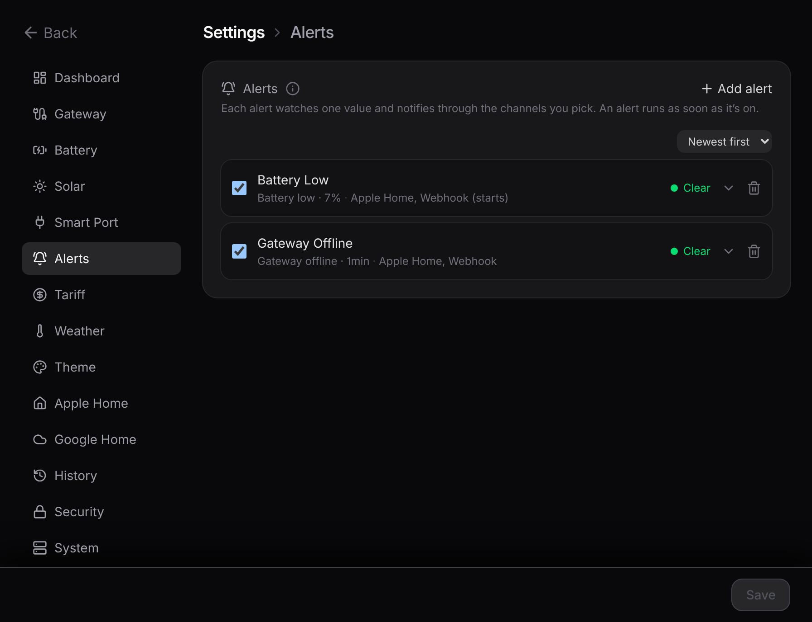

# Alerts

**Settings → Alerts** watches the live feed and tells you when something needs attention. You can build as many alerts as you like. Each one runs the moment you switch it on, so there's no master toggle to remember.

## Building one

A short form builds an alert: pick what it watches, name it, choose where it goes. The list below is one collapsible row per alert, sorted newest first, oldest, or by name.

You can watch:

- the **gateway** (offline, or back online)
- **battery charge** and **battery health**
- **grid import** and **grid export**
- **solar output**
- **home usage**
- **outdoor temperature**
- **cost per hour**

The form only offers what your setup can actually measure, so you won't see a temperature alert if weather is off.

An alert has to stay tripped for a short delay before it fires, so a single dropped reading or a momentary spike never raises a false alarm. Threshold alerts clear once the value moves back past the line, with a margin so it doesn't flap.

## Where they go

Each alert routes to **Apple Home**, a **webhook**, or both, set on the alert itself.

- **Apple Home.** The alert shows up as a contact sensor that reads Open while it's active. Turn on that sensor's own notifications in the Home app to be told. Remote notifications need a home hub (a HomePod or Apple TV). These sensors are read when the bridge starts, so adding, renaming, or retargeting one needs a restart.
- **Webhook.** Each alert gets its own web address, so different alerts can hit different services (ntfy, Discord, Home Assistant, Pushover). It sends a small message when the alert starts, ends, or both. For example, a gateway-offline alert that sends on its "end" edge is your "back online" ping.

::: tip Want the nitty-gritty?
The exact message fields, the edge (start/end) semantics, and how the debounce works are on the reference page: [Alerts engine](/reference/alerts).
:::
