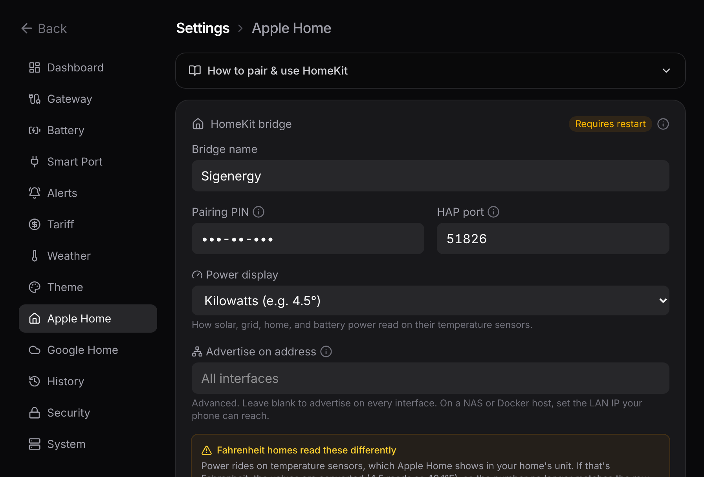

# Apple Home

Once paired, your readings show up on your iPhone, iPad, and HomePod, and you can use them in automations. It's all local; nothing goes through a cloud.

## Pairing

The bridge prints a pairing QR code and PIN to its log when it starts:

```bash
docker logs sigen-home-bridge
```

The same QR and code also live in the dashboard under **Settings → Apple Home**, so you can pair without the logs.

In the Home app: **Add Accessory**, scan the QR (or **More Options** to type the PIN, default `516-35-163`). The bridge isn't Apple-certified, so the Home app calls it an uncertified accessory; tap **Add Anyway**. Pairing survives restarts and upgrades.

## Reading the numbers

Here's the catch worth understanding up front. The Home app has no power sensor it will actually display, so the bridge borrows the ones it does. Each power reading rides in on a **Temperature** sensor (the only built-in type that shows a signed decimal), and battery charge rides in on a **Humidity** sensor. The `°` and `%` symbols are just cosmetic; read the temperatures as power and the humidity as battery charge:

| In the Home app  | Actually means                 | Example                      |
| ---------------- | ------------------------------ | ---------------------------- |
| Solar Production | Solar output in kW             | `3.2°` = generating 3.2 kW   |
| Home Consumption | Home usage in kW               | `1.0°` = using 1.0 kW        |
| Grid Power       | kW, + importing / − exporting  | `-1.1°` = exporting 1.1 kW   |
| Battery Power    | kW, + charging / − discharging | `-2.6°` = discharging 2.6 kW |
| Battery Percent  | Battery charge                 | `31%` = 31% charged          |

The readings land under Climate. The power sensors group into one Temperature tile (tap it to see each named reading) and the battery sits as a Humidity tile. A Battery service underneath flags low battery below 20%.

Use Apple Home for a glance and for automations; use the [dashboard](/guide/dashboard) for the properly labelled view.



::: warning One gotcha: Fahrenheit homes
A Temperature sensor is shown in your home's temperature unit. If your Apple Home is set to Fahrenheit, it converts these values (`4.5` shows as `40.1°F`), so the number stops matching the kW. Set the Home app to Celsius to read them directly, or just use the dashboard.
:::

## Settings

You set all of it from **Settings → Apple Home**: the pairing QR and code, the bridge name, PIN, and port, a switch to show power in watts instead of kW (`4500°` instead of `4.5°`), and an editable name for every sensor.

The name and unit are read when the bridge boots, so save and restart. And because Apple Home keeps the names it paired with, you'll need to remove and re-add the accessory to see new names.

::: tip Want the nitty-gritty?
Why power maps to temperature and battery to humidity, the exact services, and the naming model are on the reference page: [Apple Home mapping](/reference/apple-home).
:::
