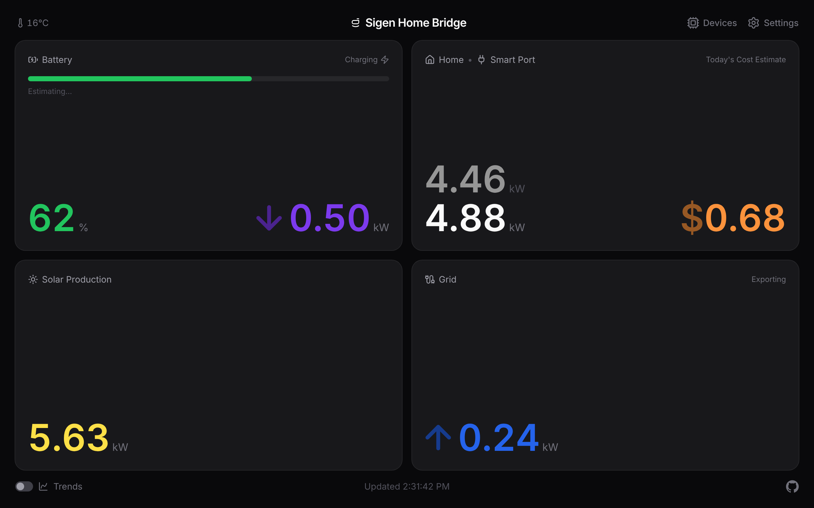
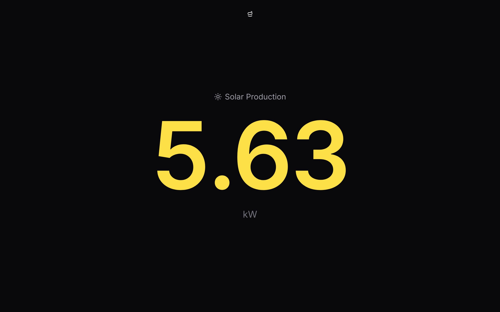
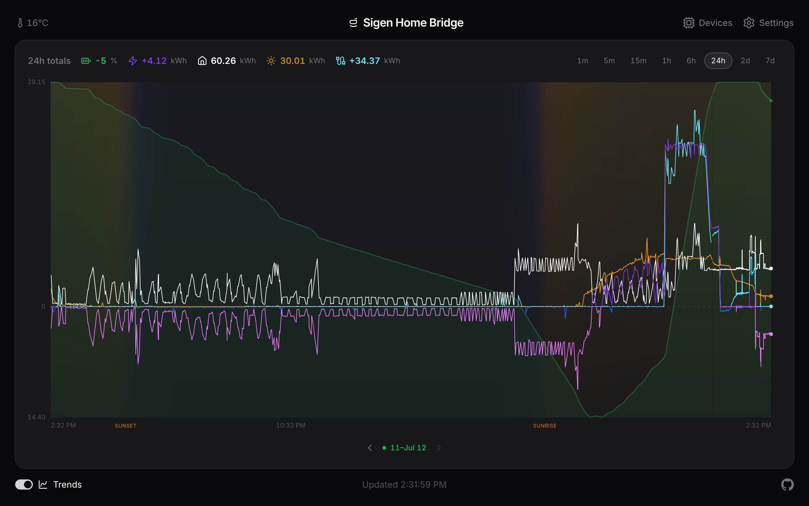
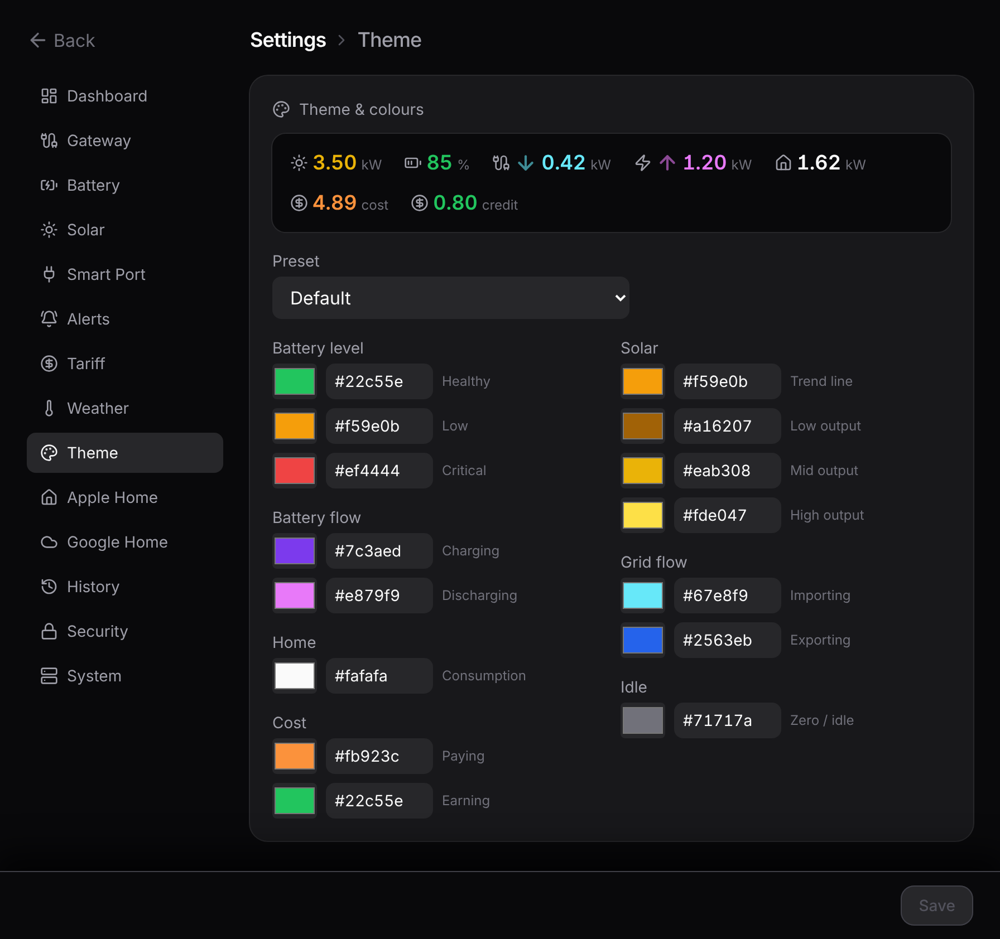

# The dashboard

The dashboard is the main screen: solar, battery, grid, and home usage, each in its own panel, all updating as the bridge reads your system. The title sits top centre, the outdoor temperature top left, and the gear (settings) top right. Along the bottom you get the connection state, the last-updated time, and a link to the source on GitHub.

Battery and grid power show a small arrow next to the number, in a darker shade of the panel's colour, so direction reads separately from the value: up for discharging or exporting, down for charging or importing, nothing when it's idle.

Tapping the title reloads the app, which is the quick fix if a home-screen copy on iOS has gone stale.

## Battery estimates

When the battery has been charging or discharging steadily for a minute or two, a line fades in under the charge bar: **"Full in 1h 45m ~3:05 pm"** while charging, or **"Empty in 3h 25m ~9:05 am"** while discharging. It reads the battery's current power flow rather than waiting for the slow charge trend, so it reacts to a change within a minute. While it's still working out the rate it shows **"Estimating…"**. When the battery is just holding steady, the line stays empty.

If you set a reserve charge in **Settings → Battery**, the discharge estimate counts down to that floor instead of to zero and reads **"Reserve in …"**, since the system won't drain past it.

## Fullscreen readouts

Tap any panel for a fullscreen readout, good for a wall display or an iPad. Tap the reading itself to cycle its layout (a plain figure, then a compact icon-and-value glyph). Tap around the reading to go back to the dashboard.

On the battery panel the left half opens the charge reading and the right half opens the power flow. The charge reads as a percentage by default; **Settings → Battery** can switch it to stored energy in kWh instead.

Every view has its own web address (`/trends`, `/metric/solar`, `/metric/battery-percent`, `/settings`, and so on), so you can bookmark a single metric or point a wall display straight at it.

## Trends {#trends}

The **Trends** switch in the lower left swaps the panels for a chart of every reading on one time axis, at its own `/trends` address. You get the power flows as lines, battery charge as a green area behind them, and a legend that totals each reading across the window you're looking at.

- **Scrub back in time.** Hover with a mouse, or press and drag on a touch screen. A cursor line snaps to the nearest reading and the legend, the clock, and the header temperature switch to that moment.
- **Read the sky.** The chart tints itself by the sun's height across the window, using your weather location, with sunrise and sunset marked on the axis. No internet calls; it's all worked out on the spot.
- **Solo a line.** Tap a reading in the legend to show just that one. Tap it again to bring them all back.
- **Pick a window.** Pills in the top right run from the last minute up to your full history. Wider windows appear as your stored history grows.
- **Step through history.** Buttons below the chart (and the arrow keys on a keyboard) walk the window back through your history and snap back to now.

Your history survives restarts; it's kept in a small database on the host. How far back the chart can reach is set under **Settings → History**, where you can also download the readings as CSV or JSON, at full detail or thinned to one row a minute.

## Colours and theming

Each reading owns a colour: solar amber, home white, grid blue, battery power violet, battery charge green. The flows that can go either way (grid and battery power) shade that colour by direction, brighter when they're supplying the home and deeper when they're soaking up surplus. Each chart line switches shade as it crosses zero, so you can read direction straight off the chart.

That's just the default. In **Settings → Theme** you can pick a preset (Default, Ember, Ocean, Mono) or edit any of the colour slots with a swatch picker or a hex code. A preview strip shows sample readings in your working palette before you save.

**Settings → Dashboard** renames the title (in the header and the browser tab), sets the power unit (kW with 0–3 decimal places, or whole watts), and scales the reading size on big screens with a slider. All of it saves on the server, so every device pointed at the bridge shows the same title, palette, and units.

::: tip Want the nitty-gritty?
The exact estimate maths, the chart's downsampling, the day/night backdrop, and the palette rules are on the reference page: [Dashboard internals](/reference/dashboard).
:::
