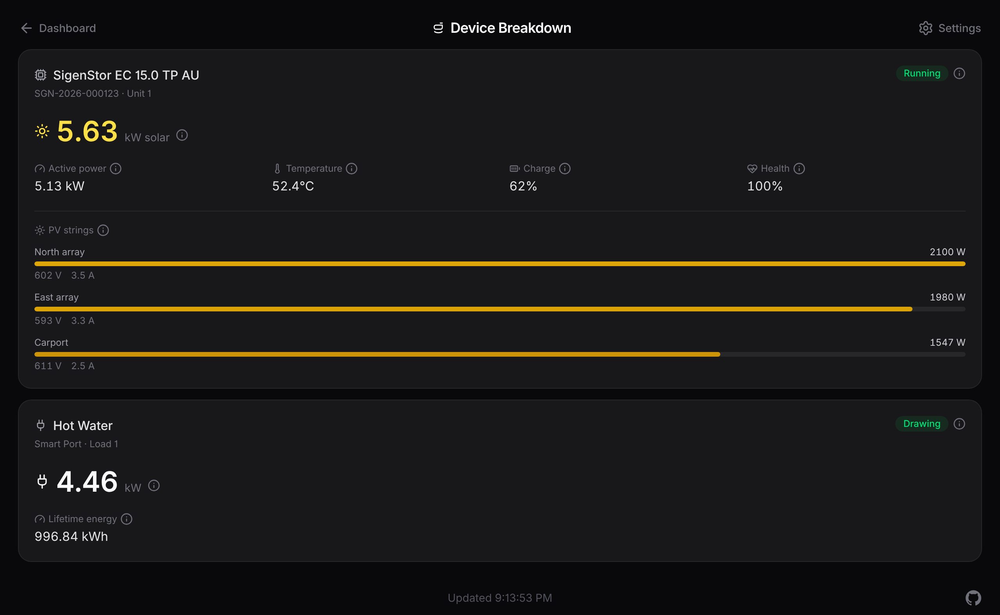
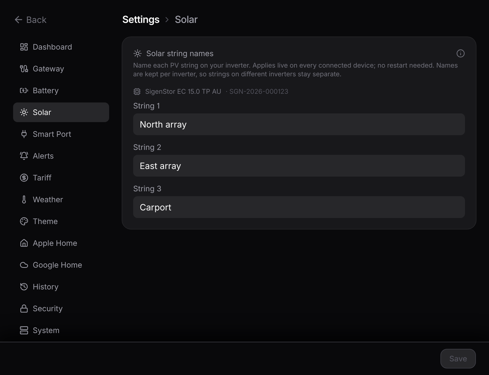

# Devices

The dashboard panels show plant totals: every inverter and every solar string added into one number. The **Device Breakdown** page (`/devices`) opens them up one by one.

## Inverters and solar strings

Each inverter the bridge finds on your gateway gets a card with its model, serial, running state, live solar and power, temperature, and its own charge and health. Under that, a bar per solar string shows that string's watts, volts, and amps.

Strings read **String 1**, **String 2**, and so on by default. Rename them to whatever you recognise (North Roof, Garage) in **Settings → Solar**. Names are kept per inverter, so strings on different inverters stay separate, and a new name shows up live with no restart.

## Smart Port loads

Anything wired to the gateway's **Smart Port** (a hot water system, a pool pump, another controlled load) gets a card too, showing whether it's drawing right now, its live power, and its total energy since it was commissioned.

Worth knowing:

- **You name the loads.** The gateway doesn't share the names you gave them in the mySigen app, so set them in **Settings → Smart Port**.
- **Idle means "not drawing", not "off".** The gateway doesn't report the switch position, so a load at zero watts reads as **Idle**, which covers both switched-off and on-but-not-drawing.

Because the gateway runs its Smart Port schedules itself, these readings keep flowing even when your internet is down.

### Put them on the dashboard

The same settings section can show the loads on the dashboard. One switch adds the combined Smart Port draw above the Home tile's total in a dimmed shade (it's part of home consumption, so it reads as "of which"), retitles the tile **Home • Smart Port**, draws a Smart Port line on the trends chart, and adds a named readout for each load to the Home panel's fullscreen.

## Reading it

Open the Device Breakdown page from the **Devices** button in the dashboard header, or from **Settings → System**. The page is read-only and updates over the same live stream as the dashboard. The same per-device data also comes through the [JSON API](/guide/json-api) in the `devices` array.

::: tip Want the nitty-gritty?
How the bridge discovers inverters and loads, which device types it doesn't read yet, and the exact per-device fields are on the reference page: [Devices & sources](/reference/devices).
:::
