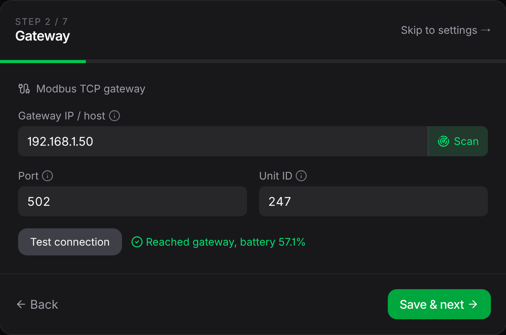
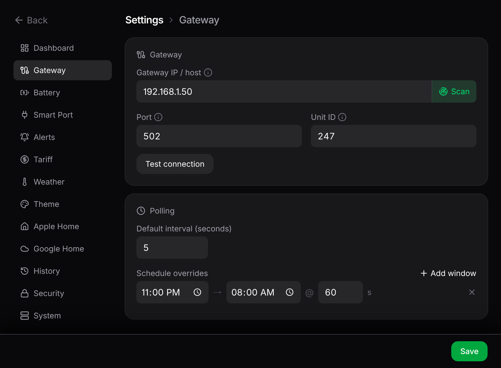

# Getting started

Switch on the data feed in the mySigen app, run the bridge, open the dashboard, and point it at your gateway. Apple Home and installing it as an app are optional extras at the end.

## 1. Switch on the local data feed

Your gateway can share its readings over your home network, but that's off out of the box. Turn it on in the mySigen iOS app (as of June 2026):

**Settings → System Settings → General → Modbus TCP Server Settings**, then toggle it on.

::: tip
If that option isn't there, your account may need installer-level access. Ask your installer to switch it on.
:::

## 2. Run the bridge

On a machine on the same network as your gateway, with Docker installed:

```bash
git clone https://github.com/furey/sigen-home-bridge
cd sigen-home-bridge
cp .env.example .env
docker compose up -d --build
```

::: info Why host networking?
The container runs with `network_mode: host` because Apple Home discovery doesn't work across Docker's private network. On a host with extra Docker networks (common on a NAS), also set `HOMEKIT_BIND=eth0` (your network interface) in `.env`. More in [Troubleshooting](/guide/troubleshooting).
:::

## 3. Open the dashboard and point it at your gateway

Browse to `http://<host-ip>:5163`. On the first run a short wizard walks you through pointing the bridge at your gateway:

1. **Scan** sweeps your network for the gateway and checks each hit with a real read, so only your actual Sigenergy box qualifies.
2. **Test connection** confirms it answers before you continue.

From there you set how often it checks your system, and optionally turn on weather, Apple Home, and Google Home. Only the gateway step is required.



### If Scan can't find it

Set the address yourself. **Don't** use the IP shown in the mySigen app; that's the gateway's own internal address and it's usually on a different network from your machines. Find the real one with a port scan (swap in your own network range):

```bash
nmap -Pn -p 502 192.168.1.0/24
```

The host that shows `502/tcp open` (not `filtered`) is your gateway. Enter that in the wizard. Then give the gateway a fixed address on your router so it never moves.

## 4. Pair Apple Home (optional)

The bridge prints a pairing QR code and PIN to its log when it starts:

```bash
docker logs sigen-home-bridge
```

::: tip
The same QR and code also live in the dashboard under **Settings → Apple Home**, so you can pair without opening the logs.
:::

In the Home app: **Add Accessory**, scan the QR (or **More Options** to type the PIN, default `516-35-163`). The bridge isn't Apple-certified, so the Home app flags it as uncertified; tap **Add Anyway**. Pairing survives restarts and upgrades. Full walkthrough on the [Apple Home](/guide/apple-home) page.

## 5. Save it as an app (optional)

The dashboard installs as a home-screen app on any phone or tablet. On iPhone or iPad, open it in Safari, then **Share → Add to Home Screen**. It gets its own icon and launches fullscreen with no address bar, which is also the easiest way to turn a spare phone or tablet into a permanent wall display. Android works the same way through Chrome's **Add to Home screen**.



Everything is editable later from the gear icon: how often it checks, battery size, power units, alerts, tariffs, themes, weather, Apple Home, Google Home. No `.env` editing, and most changes apply without a restart.

## Where next

- Learn the [dashboard](/guide/dashboard) and its trends chart.
- Turn live grid flow into money with [tariffs & cost](/guide/tariffs).
- Get pinged when something needs attention with [alerts](/guide/alerts).
- Reach the dashboard [from outside the house](/guide/remote-access), safely.
