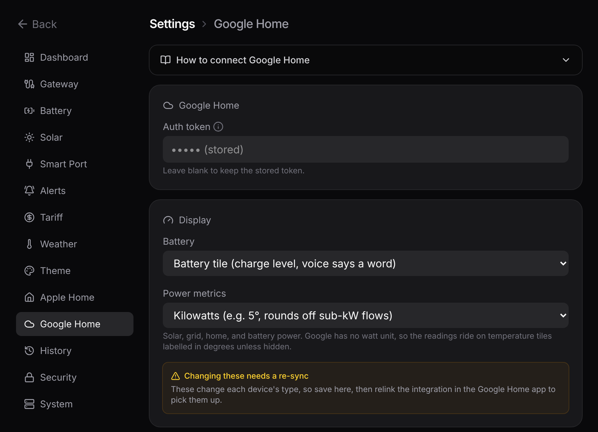

# Google Home

Google Home works, but it's more effort than Apple Home and the readings render less cleanly. Google's smart-home integrations are cloud-to-cloud: its servers call a public web address rather than reaching the bridge on your network. So you need a secure public link (a tunnel) to expose one endpoint, and Google labels the numbers less clearly.



## Setup

1. **Create a free Cloudflare Tunnel** pointing a public hostname at `http://localhost:5163`, put the token in `CLOUDFLARE_TUNNEL_TOKEN`, and start the bundled helper container:

   ```bash
   docker compose --profile tunnel up -d
   ```

   The hostname has to sit on a domain you've added to your Cloudflare account (any domain on the free plan). The throwaway `*.trycloudflare.com` quick tunnels won't do, because Google needs a stable address. See [Cloudflare Tunnel](/reference/cloudflare) for the why.

2. **In the [Google Home Developer Console](https://console.home.google.com)**, create a cloud-to-cloud project. Set the fulfillment address to `https://<your-tunnel-host>/fulfillment` and the OAuth Authorization and Token addresses to `/auth` and `/token` on the same host. The Client ID and secret can be any non-empty values; the bundled stub ignores them.

3. **Set the Auth token** in **Settings → Google Home** to any value (the shared password the stub hands back), then link the project in the Google Home app.

## What you see

- The **battery** shows up as a proper battery tile (charge level and charging state).
- The **power readings** (solar, grid, home, battery power) have no native Google watt unit, so they ride in on temperature tiles: the number is your live watts, but Google labels it with a degree symbol and rounds it to a whole number, the same trade-off the [Apple Home](/guide/apple-home#reading-the-numbers) sensors make.

**Settings → Google Home** can rename each device and set how it renders: the battery as a tile or a voice-readable percentage, and the power readings in watts, kilowatts, or hidden. These are read on each request, so a rename or new token applies on the next sync. Switching a display mode changes the device's type, so Google needs a relink to pick that up.

::: tip For the cleanest setup
If you have the choice, Apple Home is fully local and fully supported. Use Google Home when you're in Google's ecosystem and can live with the rougher labels.
:::

::: tip Want the nitty-gritty?
The intents, the trait mapping, the stub OAuth, and a sequence diagram are on the reference page: [Google Home fulfillment](/reference/google-home).
:::
