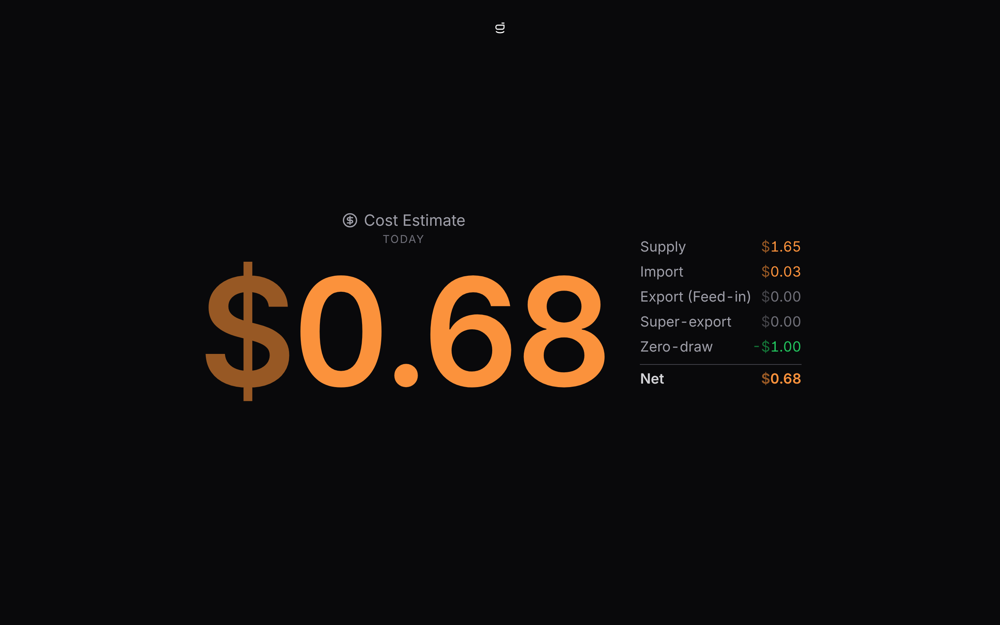

# Tariffs & cost

Enter your electricity rates in **Settings → Tariff** and the bridge turns your live grid flow into money.

Set a fallback import rate and a feed-in (export) rate, then add time-of-use windows to override them: a peak window, an off-peak window, a free period (just a window at rate 0). Windows can wrap past midnight and are read in your system's local time. One switch turns the figures on.

## What you see

The Home tile splits: consumption on the left, cost on the right. Each half opens its own fullscreen.

The cost figure shows either **today's running net** (feed-in and credits, minus import and the daily supply charge; the default) or the **current per-hour rate**. Tap it for the full breakdown: import, feed-in, credits, supply, and net.

A cost reads plain in orange. A credit shows a leading minus in green, because a minus means money in your favour. Both colours are yours to change in **Settings → Theme**.

## Extra credits

It also models less-common credits some plans offer:

- A flat daily amount for drawing **no grid power** across a window (an evening-peak "zero-draw" reward).
- A bonus rate for the **first capped kWh exported** in a window each day.

::: warning An estimate, not a bill
The figures are worked out from the rates you enter and your live readings. Treat them as a guide, not something to bill or budget against.
:::

## What it can't do

The model is deliberately simple. It doesn't handle daily volume caps, demand charges, GST or rounding, tiered or seasonal rates, controlled-load circuits, or windows that shift an hour under daylight saving. If your plan has any of those, the total will drift from your bill.

::: tip Want the nitty-gritty?
How rates resolve, how the daily figure is integrated from history, and the exact fields are on the reference page: [Energy tariffs](/reference/tariffs).
:::
