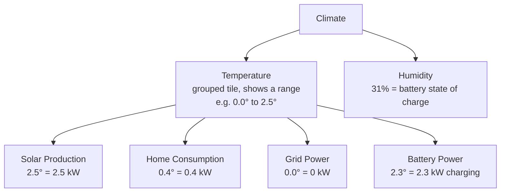

# Apple Home mapping rationale

HomeKit has no power or energy sensor that the Apple Home app will display, so each kW reading is mapped onto a Temperature sensor (the only native type that shows a signed decimal), and battery charge onto a Humidity sensor (with a Battery service underneath for the low-battery alert). The `°` is cosmetic: read every power value as kW, and the humidity percentage is the battery's state of charge.

| Reading          | HomeKit service                          | Displayed value            | Example                      |
| ---------------- | ---------------------------------------- | -------------------------- | ---------------------------- |
| Solar Production | Temperature sensor                       | kW, always ≥ 0             | `3.2°` = generating 3.2 kW   |
| Home Consumption | Temperature sensor                       | kW, always ≥ 0             | `1.0°` = using 1.0 kW        |
| Grid Power       | Temperature sensor                       | kW, + import / − export    | `-1.1°` = exporting 1.1 kW   |
| Battery Power    | Temperature sensor                       | kW, + charge / − discharge | `-2.6°` = discharging 2.6 kW |
| Battery Percent  | Humidity sensor (plus a Battery service) | % charge                   | `31%` = 31% charged          |

The Home app groups same-type sensors, so the bridge's readings land under Climate as two controls. The four power sensors collapse into one Temperature tile spanning their range (for example `0.0° to 2.5°`); tap it to see each named reading. Battery Percent shows as a Humidity tile reading the state of charge (for example `31%`). Underneath, the Battery Percent accessory keeps a Battery service that flags low battery under 20% and raises a fault when the gateway is unreachable.

The power unit is configurable in Settings → Apple Home: `kilowatts` (default, `4.5°`, `minStep` 0.1) or `watts` (`4500°`, `minStep` 1, with a widened characteristic range). It's read at boot like the other HomeKit fields, so it needs a restart. Unlike Google, this is cosmetic rather than a fix: HomeKit renders the decimal, so kW never collapses to zero the way Google's whole-degree rounding does.

## The Celsius catch

One sharp edge comes free with the temperature trick: `CurrentTemperature` is always Celsius on the wire, and the Home app converts it to the home's display unit. A home set to Fahrenheit will show `4.5` as `40.1°F`, so the number stops matching the kW or watts. There's no per-accessory unit override in HomeKit, so the only fixes are setting the Home app to Celsius or reading the values on the dashboard. The UI and README both flag this.

Power gets temperature because it is the only native sensor that carries a sign, so grid export and battery discharge can read negative; humidity and light are positive-only (0 to 100%, and lux ≥ 0). Battery charge is naturally 0 to 100%, so it maps cleanly onto a Humidity sensor, which is why the Battery Percent tile reads as a percentage. HomeKit does define power and energy characteristics (the Eve-style custom ones), but the Apple Home app ignores them; they only surface in third-party apps like Eve. So these mappings are the cost of seeing the numbers in Apple's own app. For a properly labelled view use the web dashboard, and lean on HomeKit for automations (trigger when Solar Production climbs above a threshold) and a quick glance.

## Naming and pairing

Every name here is editable in Settings → Apple Home, stored under `homekit.labels` alongside the bridge's manufacturer and model; the defaults match the table above. Accessory identity stays keyed on the metric rather than the name, so renaming changes only the label HomeKit shows and never the pairing. The names are read once when the bridge builds its accessories, so a change needs a restart, and because Apple Home caches the names it paired with, you remove and re-add the accessory in the Home app to pick up new ones. The live pairing payload (setup URI, pairing code, and a QR) is served at `GET /api/homekit/pairing`, which is what the Apple Home settings page renders so you can pair without reading the container logs.

If another instance is already advertising the same name on the LAN (say a dev copy next to the deployed one), the advertiser resolves the clash by renaming itself (`Sigenergy (2)`) instead of crashing.
