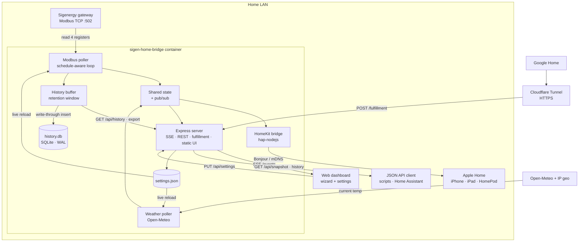
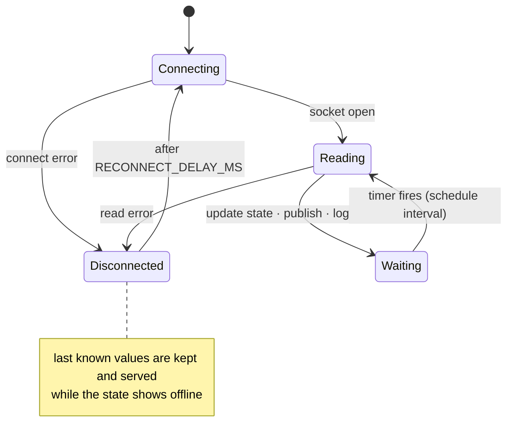

# Architecture

A single process holds one persistent Modbus TCP socket to the gateway and polls four registers on a timer (battery power is derived from them). Each cycle writes to a shared in-memory state object and pushes it to three consumers:

- **HomeKit** via `hap-nodejs`, advertised over your LAN with Bonjour. Fully local, no cloud.
- **Google Home** via Smart Home fulfillment over HTTPS (needs a tunnel; see [Google Home fulfillment](/reference/google-home)).
- **The dashboard** via Server-Sent Events, so the browser updates the instant a poll completes.

Each cycle is also appended to an in-memory history buffer that backs the dashboard's trends chart, served over `GET /api/history` (the recent 20,000 samples, or a downsampled slice when the chart reaches further back). The buffer is the read cache; the durable copy is a SQLite database at `/data/history.db` (built-in `node:sqlite`, WAL mode), written through one row per poll rather than rewriting a snapshot, so a week of 5-second readings costs a few MB of writes a day instead of gigabytes (safe on an SD card or SSD). A configurable retention window (Settings → History, default 7 days) bounds both the buffer and the database; older samples are trimmed in memory on each poll and pruned from the database on a five-minute timer. The full retained set exports as CSV or JSON, optionally thinned to one row per interval, via `GET /api/history/export`; `GET /api/history/stats` reports the held count and span. An existing `history.json` from an older build is imported into the database once on first boot and renamed to `history.json.imported`.

A separate timer fetches the outdoor temperature from Open-Meteo and merges it into the same state. All configuration (gateway, polling, weather, HomeKit, Google) is editable in the dashboard's setup wizard and settings page, saved to `settings.json`, with most changes applied live (gateway edits reconnect the socket; HomeKit and the server port need a restart).

The gateway address can also be auto-detected. `POST /api/discover/gateway` (the **Scan** button on the gateway field in the wizard and settings) derives the /24 around each non-internal IPv4 interface (host networking means these are the real LAN interfaces), attempts a plain TCP connect to the Modbus port on all 254 hosts (64 concurrent, 600 ms timeout), then confirms each answering host with an actual SoC register read so only a real Sigenergy gateway qualifies. A clean sweep of an empty subnet takes about 3 seconds; the wizard runs it automatically when the gateway field is blank, fills the field on a single match, and offers a pick list if several answer.

## Poller lifecycle

If the gateway drops, the poller logs the error, marks the state disconnected, and retries on a fixed delay without ever crashing or zeroing the last known values.

The weather poller is similarly failure-tolerant: a failed fetch gets one immediate second attempt, and until the first reading lands the poller tries every 30 seconds (the same cadence covers a failed location lookup) before settling into the normal refresh interval, so a flaky API briefly delays the temperature instead of hiding it until the next restart.
