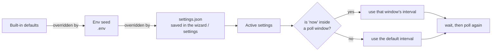

# Configuration

## Settings precedence

Every value in `.env` is a seed for first boot. Once you save in the UI it's written to `/data/settings.json`, which takes precedence (`TZ`, `CLOUDFLARE_TUNNEL_TOKEN`, and `DATA_DIR` are the exceptions; they're read from the environment at process start). Most changes apply immediately: editing the gateway reconnects the Modbus socket, weather reloads its fetch loop, and poll edits take effect on the next cycle. The HomeKit fields and the HTTP server port can't change on a running process, so they're marked "requires restart" and apply on the next start. The Google token is write-only: it's never sent back to the browser (shown as `••••• (stored)`), so leave it blank to keep the current value. The optional Settings passcode is similar: it lands in the `security` section as a salted scrypt hash, the API reports only whether one is set, and once set every settings change must carry a session token from `POST /api/unlock`. Reset wipes `settings.json` back to the env seeds and re-runs the wizard.

For polling, set a default interval, then add overrides: time windows that poll at their own rate. For example, keep the default at 5 seconds and add an overnight override of 60 seconds from 23:00 to 08:00, so the system isn't hammered while nothing changes. Windows use the container's local time, so set `TZ`.

## Full configuration reference

Copy `.env.example` to `.env`. Every value has a default. These are seeds for the first boot; once you save in the wizard or settings they're written to `/data/settings.json`, which takes precedence.

| Variable                  | Default                    | Purpose                                                                 |
| ------------------------- | -------------------------- | ----------------------------------------------------------------------- |
| `SIGEN_IP`                | _(empty)_                  | Gateway address; set it or use the setup wizard                         |
| `SIGEN_PORT`              | `502`                      | Modbus TCP port                                                         |
| `SIGEN_UNIT_ID`           | `247`                      | Plant (aggregate) unit ID                                               |
| `POLL_INTERVAL_MS`        | `5000`                     | Fallback interval when no schedule window matches                       |
| `RECONNECT_DELAY_MS`      | `10000`                    | Delay between reconnect attempts                                        |
| `POLL_SCHEDULE`           | _(empty)_                  | Seed for the schedule editor, e.g. `08:00-12:00@5000,17:00-21:00@10000` |
| `TZ`                      | `UTC`                      | Local time zone for schedule windows                                    |
| `SERVER_PORT`             | `5163`                     | Dashboard and fulfillment port                                          |
| `WEATHER_ENABLED`         | `true`                     | Set `false` to hide the header temperature and skip all weather calls   |
| `LATITUDE`                | _(auto via IP)_            | Pin exact latitude; unset means a one-off IP-based geolocation          |
| `LONGITUDE`               | _(auto via IP)_            | Pin exact longitude; unset means a one-off IP-based geolocation         |
| `WEATHER_UNITS`           | `celsius`                  | `celsius` or `fahrenheit`                                               |
| `WEATHER_REFRESH_MS`      | `600000`                   | How often to refresh the outdoor temperature                            |
| `HISTORY_RETENTION_DAYS`  | `7`                        | Days of trend history to keep (1–90); editable under Settings → History |
| `HOMEKIT_NAME`            | `Sigenergy`                | HomeKit bridge name                                                     |
| `HOMEKIT_PIN`             | `516-35-163`               | HomeKit pairing PIN                                                     |
| `HOMEKIT_PORT`            | `51826`                    | HAP server port                                                         |
| `HOMEKIT_BIND`            | _(all interfaces)_         | Limit the HomeKit advertisement to one interface/IP (e.g. `eth0`)       |
| `GOOGLE_AUTH_TOKEN`       | `sigen-home-bridge-token`  | Static bearer for the stub OAuth                                        |
| `CLOUDFLARE_TUNNEL_TOKEN` | _(empty)_                  | Token for the `cloudflared` sidecar                                     |
| `DATA_DIR`                | `./data` (Docker: `/data`) | Pairing state and saved settings                                        |

`POLL_SCHEDULE` is a comma-separated list of `HH:MM-HH:MM@INTERVAL_MS` windows. A window may wrap past midnight (`22:00-06:00`). The first matching window wins; outside all of them the default interval applies. Once you save in the dashboard, `/data/settings.json` overrides this seed.

::: info State on disk
Bridge state (HomeKit pairing, saved settings, chart history) lives in a named Docker volume (`sigen-data`) that survives restarts, rebuilds, and `docker compose down`. Only `down -v` wipes it. To keep state in a host folder you can browse, swap `sigen-data:/data` for a bind mount like `./data:/data` in `compose.yaml`.
:::
