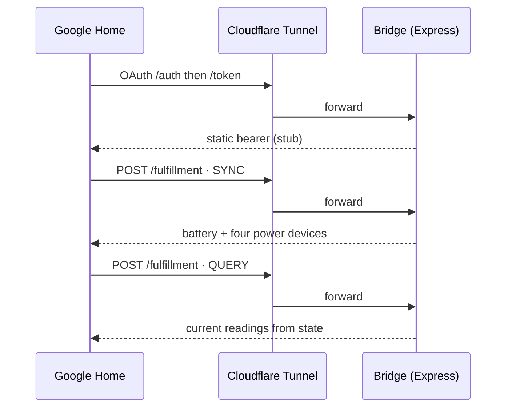

# Google Home fulfillment

Google has deprecated the Actions Console and is steering integrations toward cloud-to-cloud rather than self-hosted fulfillment, and the old `actions-on-google` library is unmaintained. This project therefore implements the SYNC, QUERY, EXECUTE, and DISCONNECT intents as plain Express handlers with no external library. Everything is read-only; EXECUTE is a no-op.

The bridge ships a stub OAuth that accepts anything and returns a static bearer (`GOOGLE_AUTH_TOKEN`); this is for personal use only.

## Two traits for five readings

Google's device model is stricter than HomeKit's, so the five readings map to two different traits. The battery is a genuine energy store, so it uses the `EnergyStorage` trait on a `SENSOR` device: the bridge reports `descriptiveCapacityRemaining` (Critically low through Full, mapped from the state of charge), the percentage, and charging state, and Google draws a real battery tile.

The four power metrics are the awkward ones. Google's `SensorState` trait only models a closed list of sensor types (air quality, CO, CO₂, particulates, and similar) with fixed units; there is no watt unit, and a custom sensor name renders as a blank tile. The one trait that reliably shows an arbitrary read-only number is temperature, so each power metric rides in on a query-only `TemperatureControl` device carrying its live wattage as `temperatureAmbientCelsius`. Google labels the value with a degree symbol and rounds it to a whole number, so you read "285°" as 285 W. It is misleading but legible, and it mirrors what the HomeKit integration already does with temperature sensors. HomeKit shows the same flows in kW because it renders one decimal place; Google rounds, so the bridge sends whole watts there to keep sub-kilowatt flows from collapsing to zero.

## Configurable trade-offs

Both halves are configurable in Settings → Google Home, since Google's trade-offs cut different ways for different people. The battery can render as the `EnergyStorage` tile (charge level and charging state, but voice answers with a descriptive word like "OK") or as a plain percentage reading on a temperature device (voice speaks the number, but there is no battery glyph). The power metrics can read in watts (full resolution), kilowatts (tidy numbers, but Google rounds off anything under half a kilowatt), or be hidden (a blank `SensorState` device, no misleading degree unit). Each device's name is editable too. The settings are read per request, so they take effect on the next sync; changing the display mode swaps the device's trait, so Google needs a relink to pick it up. For a fully local, fully supported setup, use [HomeKit](/reference/apple-home).
